# Yogurt Architecture

How the system actually works, traced from the code rather than the plan.
Diagrams are Mermaid, so GitHub renders them inline.

Companion docs: [archive/PRD.md](./archive/PRD.md) for the original product intent, this file for mechanism, [DEBUGGING-TRANSCRIPTS.md](./DEBUGGING-TRANSCRIPTS.md) for inspecting a live transcript by hand.

- [0. Glossary](#0-glossary)
- [1. High-level map](#1-high-level-map)
- [2. Process and thread topology](#2-process-and-thread-topology)
- [3. Boot and session-token handshake](#3-boot-and-session-token-handshake)
- [4. Sequence: record a meeting, live transcript](#4-sequence-record-a-meeting-live-transcript)
- [5. Sequence: end meeting and enhance notes](#5-sequence-end-meeting-and-enhance-notes)
- [6. Sequence: in-meeting chat streaming](#6-sequence-in-meeting-chat-streaming)
- [7. Local mode: on-device STT and LLM](#7-local-mode-on-device-stt-and-llm)
- [8. Where state lives](#8-where-state-lives)
- [9. Trust boundaries](#9-trust-boundaries)
- [10. AI usage and cost map](#10-ai-usage-and-cost-map)
- [11. Key decisions and rejected alternatives](#11-key-decisions-and-rejected-alternatives)

---

## 0. Glossary

The doc leans on a few acronyms. The first three carry most of the weight.

| Term | Means | In yogurt specifically |
|---|---|---|
| **STT** | **Speech to text.** Turning spoken audio into written words, also called ASR or "transcription". | The `yogurt-stt` crate. It has two interchangeable engines behind one `Stt` trait: Deepgram in the cloud, or whisper.cpp running on your Mac. This is what produces the live transcript. |
| **LLM** | **Large language model.** The thing you send text to and get text back from (GPT, Claude, Llama, MiniMax). | Used in exactly two places: turning your sparse notes plus the transcript into augmented notes ("enhance"), and answering chat questions about the meeting. Never used for transcription. |
| **VAD** | **Voice activity detection.** A cheap check for "is anyone actually talking right now?" that runs before the expensive model does. | Only on the local STT path (`vad.rs`). It chops continuous audio into utterances and skips silence entirely, which is why local transcription costs nothing while idle. |

Supporting cast, in rough order of how often they appear:

| Term | Means |
|---|---|
| **WS** | WebSocket. A persistent two-way connection, unlike a one-shot HTTP request. Used to push transcript lines and chat tokens to the browser as they happen. |
| **SPA** | Single-page application. The React frontend, served as one HTML page that swaps views client-side. |
| **PCM** | Raw uncompressed audio samples. "16 kHz mono i16 PCM" means 16,000 samples per second, one channel, each sample a 16-bit integer. |
| **ScreenCaptureKit / SCK** | Apple's macOS framework for capturing screen and system audio. It is how yogurt hears the other side of a call without joining as a bot. |
| **loopback** | Capturing the audio your Mac is *playing* (the other participants) rather than what your mic hears. |
| **TCC** | Apple's permissions system (Transparency, Consent, and Control). The source of the "allow Screen Recording?" prompts. |
| **WAL** | Write-ahead logging, a SQLite mode where readers do not block the writer. |
| **FTS** | Full-text search. SQLite's built-in search index, used for the Library search box. No AI involved. |
| **RAII** | A Rust/C++ pattern where cleanup happens automatically when a value is dropped. Here: dropping the audio handle stops the microphone. |
| **SSE** | Server-sent events. The streaming format LLM providers use to send a response token by token. |
| **ULID** | A sortable unique identifier, like a UUID but time-ordered. Used for provider ids. |
| **Metal / CoreML / ANE** | Apple hardware acceleration. Metal is the GPU (enabled), CoreML/ANE is the Neural Engine (deliberately not enabled). |
| **ggml** | The tensor library whisper.cpp is built on. `.bin` model files are in its format. |
| **diarization** | Working out who spoke. Yogurt does the minimum version: mic is "Me", system audio is "Them". |
| **endpointing** | How long a speaker must pause before the engine decides the sentence is over. |
| **backpressure** | What a system does when data arrives faster than it can be processed. |
| **mojibake** | Garbled text from a character-encoding mismatch, e.g. `…` where `…` belongs. |

---

## 1. High-level map

One Rust process. No sidecars, no IPC, no subprocesses.
If any acronym below is unfamiliar, [section 0](#0-glossary) defines them.
The browser is a dumb-ish render surface: it holds the editor buffer and nothing else authoritative.

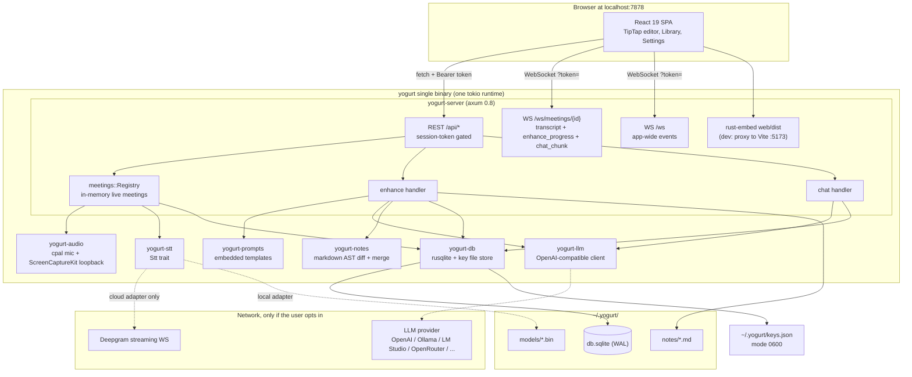

Crate responsibilities, one line each:

| Crate | Owns |
|---|---|
| `yogurt-cli` | Arg parsing, `--dev` mode, `.env.local` load (dev only), calls `yogurt_server::run`. |
| `yogurt-server` | axum router, auth, meeting registry, enhance/chat orchestration, WS fan-out, embedded assets. |
| `yogurt-audio` | Mic (cpal) + system loopback (ScreenCaptureKit), resample to the frame contract, broadcast frames. |
| `yogurt-stt` | Speech to text. `Stt` trait plus two impls: `DeepgramStt` (cloud WS) and `WhisperLocal` (whisper.cpp, feature `local-stt`). |
| `yogurt-notes` | Markdown parse, block-level diff of user notes vs LLM output, render back to wire-format markdown. |
| `yogurt-prompts` | Embedded prompt templates and their render context. |
| `yogurt-llm` | `LlmClient` trait, OpenAI-compatible HTTP client with `base_url` override, SSE streaming. |
| `yogurt-db` | SQLite open/migrate, `MeetingRepo`, settings, providers, `ApiKeyStore` over `~/.yogurt/keys.json`. |

### The one format contract that everything downstream depends on

`yogurt-audio` emits **16 kHz mono i16 PCM, 320 samples (20 ms) per `Frame`**, on two independent channels.
Both STT adapters consume exactly that.
Nothing resamples at the STT boundary.
Mic renders as "Me", system loopback renders as "Them", which is the whole of our diarization (deliberately, per PRD 5.2).

---

## 2. Process and thread topology

The interesting constraint: `cpal::Stream` is `!Send`, so the capture handle cannot live in a tokio task.
That single fact shapes the whole recording path.

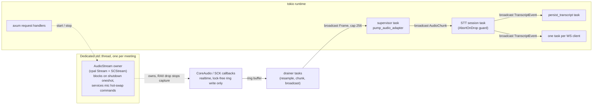

Rules that hold this together:

- **Realtime callbacks never allocate, never lock, never broadcast.**
  They write into a ring buffer; a tokio drainer does the resample, quantize, chunk, and broadcast.
- **RAII is the stop mechanism.**
  Dropping `AudioStream` stops both cpal and the `SCStream`.
  `stop()` joins the capture thread so a back-to-back start cannot open an overlapping SCK session.
- **The capture thread body is wrapped in `catch_unwind`.**
  A panic inside ScreenCaptureKit (usually a TCC denial) becomes a clean HTTP 400 with a permission hint instead of a mystery "channel closed".
- **The STT task is held by an `AbortOnDrop` guard** owned by the supervisor.
  Aborting the meeting aborts the Deepgram WS / unloads the whisper model with it.
- **Broadcast, not mpsc, for frames.**
  Capacity 256 frames is about 5 seconds. A slow consumer gets `Lagged(n)` and drops old audio, which is correct for wall-clock-bound speech.

---

## 3. Boot and session-token handshake

Everything except the token handout and health requires a bearer token.
The token endpoint itself is gated by an Origin allowlist, because it *is* the token.

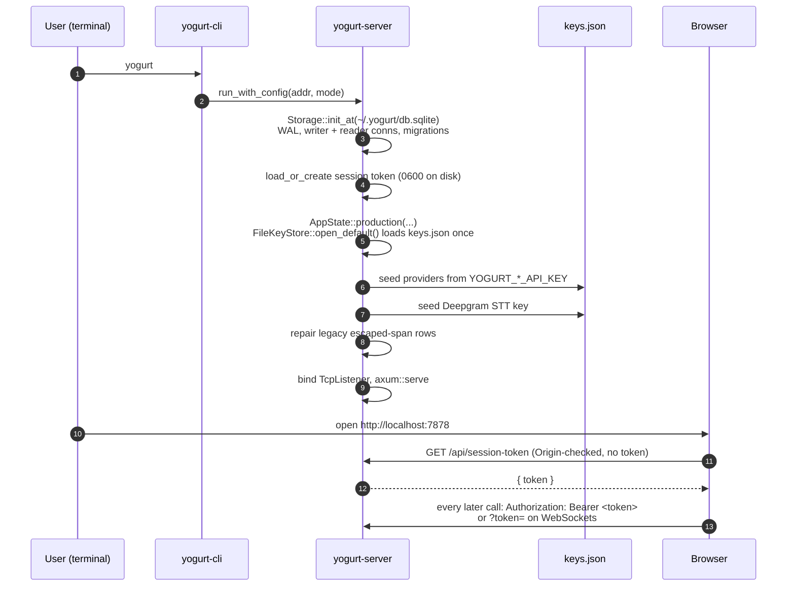

Why `?token=` on WebSockets: the browser `WebSocket` API cannot set headers, and echoing a subprotocol for auth violates RFC 6455 if done sloppily.
The tradeoff accepted is tokens in URLs, mitigated by redacting `?token=` from tracing output.

---

## 4. Sequence: record a meeting, live transcript

This is the hot path. Note that the browser never accumulates the transcript, the server does.

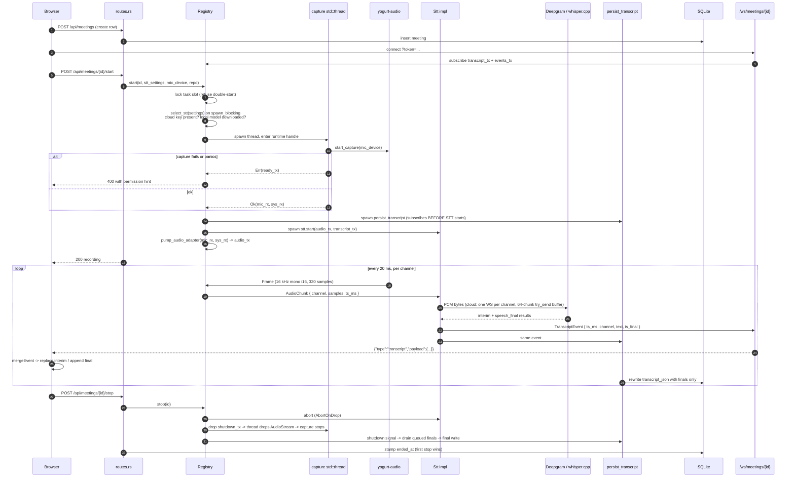

Details that matter and are easy to get wrong:

- **`is_final` comes from Deepgram's `speech_final`, not its `is_final`.**
  `is_final` marks an interim-final that will not be revised; `speech_final` marks end of utterance.
  Reading the wrong field made every interim-final render as a new locked line.
  `endpointing=1000` (ms) is what turns clause fragments into sentence-shaped lines.
- **Subscription order is load-bearing.**
  Persistence and STT both subscribe *before* the audio pump publishes, so no opening words are dropped.
- **Backpressure is visible, not silent.**
  Each cloud channel has a 64-chunk `try_send` buffer. After 50 consecutive drops (about 1 s) the server emits a `[stt overloaded, transcript may be lossy]` status line rather than quietly losing audio.
- **The frontend reconnects with exponential backoff**, capped at 3 attempts, with `connecting` / `reconnecting` / `offline` surfaced in the UI.

To inspect a live transcript by hand - tail what SQLite has stored, read the raw WS frames, or work out why the dock and the database disagree - see [DEBUGGING-TRANSCRIPTS.md](./DEBUGGING-TRANSCRIPTS.md).

---

## 5. Sequence: end meeting and enhance notes

The hero flow.
The browser sends the raw `notes_md` document; the server owns the transcript, the prompt, the merge, and both persistence targets.
The post-meeting UI keeps `notes_md` and `enriched_md` in separate My notes and Enhanced tabs.
Only My notes is editable (debounced autosave of `notes_md`); Enhanced is read-only and changes only through Re-enhance.
Re-enhance always replaces `enriched_md` from the unchanged raw notes plus transcript and never uses the previous generated summary as input.

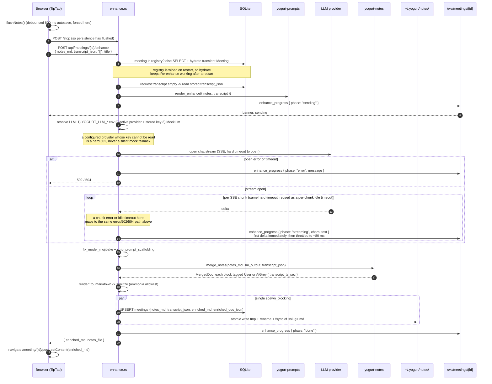

The black/grey UX in one paragraph: `yogurt-notes` parses both the user's markdown and the LLM's markdown into block ASTs, keys blocks by normalized text, and for every LLM block that is not a user block emits `Source::AiGrey` with a guessed transcript timestamp.
`render::to_markdown` wraps those in `<span data-ai-grey data-ts=...>`, which is the wire format TipTap styles grey and makes click-to-transcript work.
User blocks pass through verbatim, which is the invariant that makes the feature trustworthy.

Two defensive layers exist because real models misbehave: mojibake repair (CP1252-mangled punctuation observed live from MiniMax), scaffolding strip (models echoing the prompt's XML section tags), then ammonia sanitization before anything is persisted, so a hallucinated `<script>` never reaches SQLite or disk.

---

## 6. Sequence: in-meeting chat streaming

REST kicks it off and returns immediately; tokens arrive over the same per-meeting WebSocket the transcript uses.

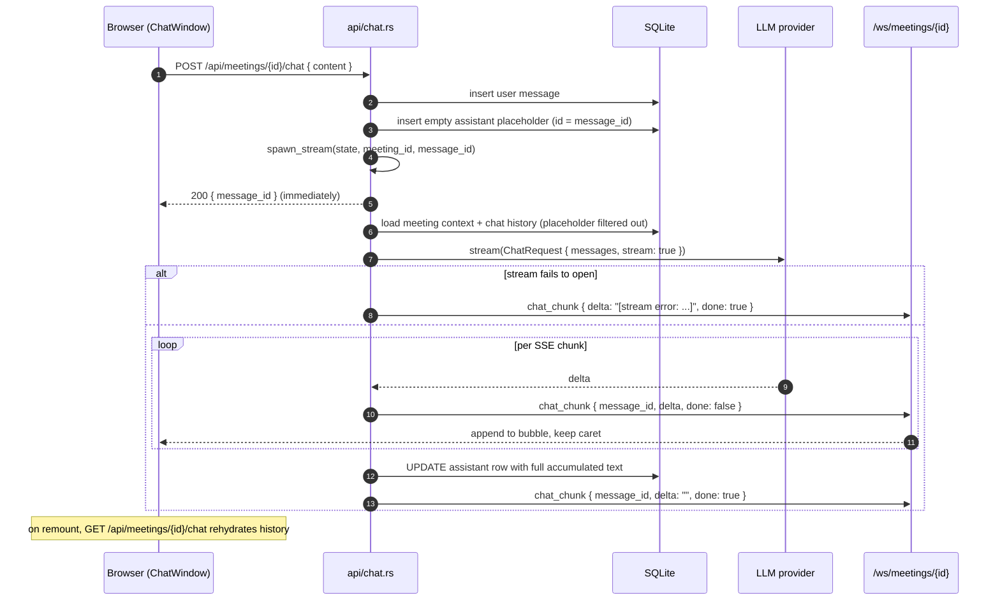

Same WebSocket, one discriminator convention: every frame is `{"type": "<snake_case>", ...}`.
`transcript` frames nest their body under `payload`; `enhance_progress` and `chat_chunk` are flat.

---

## 7. Local mode: on-device STT and LLM

Local mode is the privacy escape hatch: no audio and no notes leave the machine, and the marginal cost is zero.
It is not the default, and the code is honest about why (see the quality caveat at the end).

Two independent switches, either can be flipped without the other:

| Switch | Setting | Default | Off-machine traffic when local |
|---|---|---|---|
| STT | `settings.stt_provider` = `cloud` \| `local` | `cloud` | none, audio never leaves |
| LLM | active row in `providers` pointed at a localhost `base_url` | none configured | none, notes never leave |

### 7.1 Getting a model onto disk

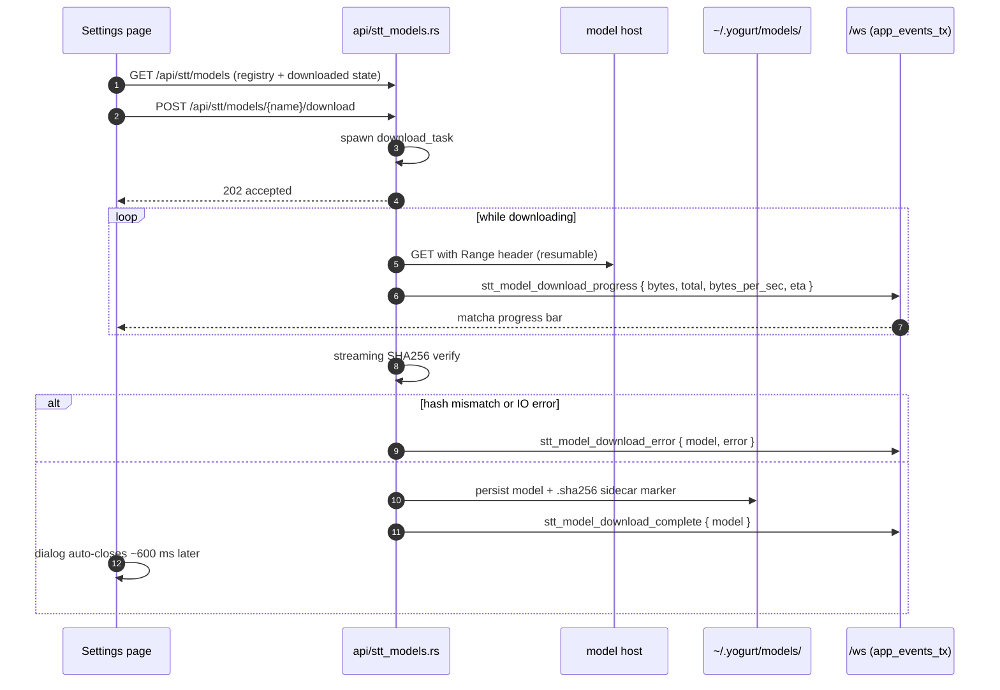

Models come from the `ggerganov/whisper.cpp` HuggingFace repo, and every SHA256 in `models::REGISTRY` was verified against the real blob (2026-06-28) rather than copied from a manifest.
A hash mismatch deletes the file and shows the expected/actual pair in the dialog, so a truncated or MITM'd download can never be silently used.

At meeting start, `select_stt` checks the `.sha256` sidecar rather than rehashing a multi-GB file.
The one-time legacy migration path *can* hash, which is why the whole check runs on `spawn_blocking`.
`WhisperLocal::load` then reads the model (up to 3 GB) and runs ggml init, also on `spawn_blocking`.

### 7.2 How local decoding actually works

The cloud adapter hands audio to Deepgram and gets lines back. The local adapter has to build that behavior itself, and it does so with a **VAD gate plus two different decoders against one shared model**.

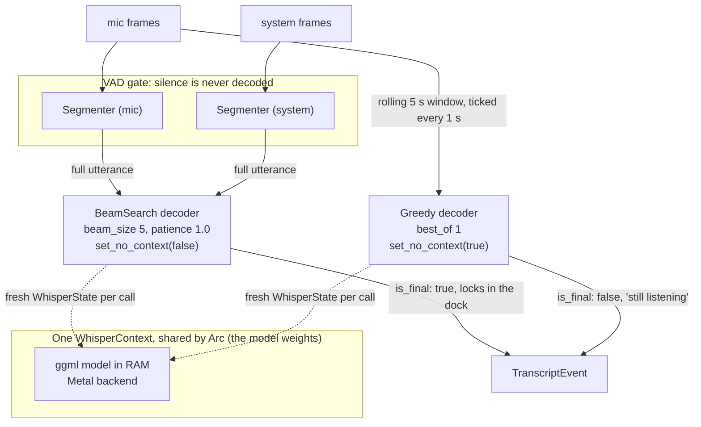

The pieces, and why each is shaped that way:

- **VAD first, decode second.** `vad.rs` only emits a segment when speech was actually present: `MIN_SPEECH_MS` 250 (shorter is a cough or a click, discarded), `SILENCE_HANG_MS` 600 (end of utterance), `MAX_SEGMENT_MS` 25 s (hard cap so one long monologue cannot stall the decoder). Silence costs literally nothing, which is the structural difference from the cloud path.
- **Mic and system get their own segmenter.** They are independent speakers with independent pauses, so a shared segmenter would splice "Me" and "Them" into one utterance.
- **Two sampling strategies, one model.** Greedy `best_of: 1` on a rolling 5 s mic window every 1 s produces the live "still listening" partials. BeamSearch `beam_size: 5, patience: 1.0` on complete utterances produces the finals the dock locks in place. Beam search is much slower and much better, which is exactly the right tradeoff when one output is throwaway and the other is permanent.
- **`set_no_context` differs per decoder.** The partial decoder runs with `no_context(true)` so it cannot carry a hallucination forward from the previous window. The final decoder runs with `no_context(false)` so consecutive utterances read coherently.
- **`WhisperState` is created fresh per decode**, while the `WhisperContext` (the weights) is shared by `Arc`. `create_state` is cheap and pooling would complicate the `spawn_blocking` lifetimes for no gain.

> **The invariant not to break.** `whisper_full` is synchronous C++ that blocks for hundreds of ms to several seconds. Every decode site in `whisper_local.rs` is wrapped in `tokio::task::spawn_blocking`: the mic final decoder, the system final decoder, and the partial ticker. Remove one and you deadlock the WebSocket broadcast pump under load. There should always be at least three occurrences in that file.

### 7.3 Choosing a model

| Model | Disk | Intel Macs | Notes |
|---|---|---|---|
| `tiny.en` | 75 MB | yes | Fastest, roughest. Fine for a smoke test. |
| `small.en` | 487 MB | yes | **The seeded default** (`V005`). The intended balance point. |
| `medium.en` | 1.5 GB | no | Apple Silicon only. |
| `large-v3` | 3.1 GB | no | Apple Silicon only. Beam-search finals on this are slow enough to feel it. |

All four are English-only or English-first, matching the app's single-language v1 scope.
`intel_supported` is a real gate, not a hint: the two larger models are marked unsupported on x86 Macs because Metal acceleration is not there to carry them.

Build-side, local STT is behind a Cargo feature:

- `whisper-rs` is pulled in only by `yogurt-stt`'s `local-stt` feature, with `metal` enabled at that crate level.
- `yogurt-server` turns `local-stt` on, so shipped binaries have it; a bare `yogurt-stt` build does not drag in whisper.cpp's CMake toolchain.
- `coreml` (ANE acceleration) is deliberately not enabled. It would add a CoreML model-conversion step to the build.

### 7.4 The local LLM side

Local STT and a local LLM are independent choices. The LLM half needs no new code at all, because `yogurt-llm` speaks OpenAI-compatible HTTP and `OpenAiCompatClient` takes an arbitrary `base_url`.
Two of the shipped presets are already localhost:

| Preset | `base_url` | Default model |
|---|---|---|
| Ollama (local) | `http://localhost:11434/v1` | `llama3.2` |
| LM Studio (local) | `http://localhost:1234/v1` | (blank, you pick in LM Studio) |

Pointing the active provider at either one makes enhance and chat fully local.
Nothing else in the pipeline changes: the same prompts render, the same merge runs, the same sanitizer applies.
The API-key field is still there and still writes to the key file, which local servers simply ignore.

### 7.5 The honest caveat

Local partial quality is openly worse than Deepgram's, and the code says so in `whisper_local.rs`: it is *"the privacy escape hatch, not the daily driver"*.
Greedy decoding on a 5 s window cannot match a cloud model with a full acoustic context, and beam-search finals arrive after the utterance ends rather than streaming through it.
What you get in exchange is that no audio and no notes ever leave the machine, and the meeting costs nothing.
That is a real tradeoff presented as one, not a feature-parity claim.

## 8. Where state lives

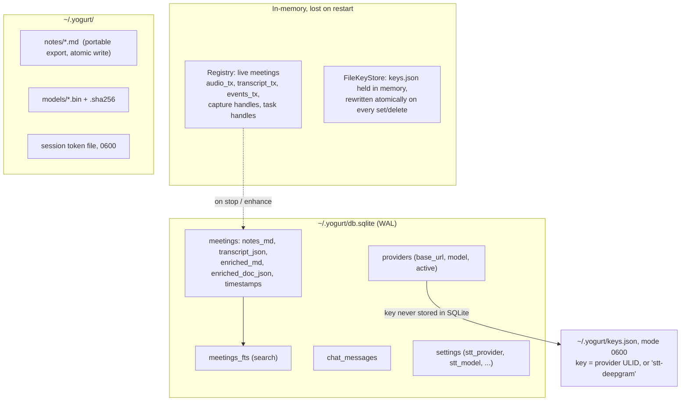

Notes on the storage layout, since it surprises people reading the code:

- **One SQLite file, two independent openers.**
  `yogurt-server::storage` (Phase 0: `meetings`, `chat_messages`) and `yogurt-db` (`providers`, `settings`, `meetings` repo, FTS) both resolve `~/.yogurt/db.sqlite` and both run their own idempotent migrations.
  They deliberately do not depend on each other for path resolution. Keep the two path helpers in sync if that path ever moves.
- **`storage` uses a dual pool**: one writer connection behind a mutex, one read-only connection, WAL with `synchronous=NORMAL`.
- **rusqlite is synchronous**, so every DB touch inside a request handler goes through `spawn_blocking`. Same for the markdown export, which does write + rename + fsync.
- **API keys are never in SQLite and never in a response body.** The providers table holds `base_url`, model, and active flag; the secret lives in `~/.yogurt/keys.json` keyed by the provider's ULID (or `stt-deepgram` for the STT singleton). Responses return a masked suffix only.
- **The key file is read once and held in memory.** `FileKeyStore::open` (`yogurt-db/src/keys.rs`) parses `keys.json` at boot into a map behind an `RwLock`; every `get` is a map lookup, so key reads happen inline in request handlers with no `spawn_blocking` and no timeouts. Every `set`/`delete` rewrites the whole file through a same-directory temp file with mode 0600 and an atomic rename, so a crash mid-write can never truncate it. The file is created on the first write, not at boot.
- **Tests never touch the real key file.** `YOGURT_MEMORY_KEYSTORE=1` (set by `just test` and CI) makes `AppState::production` use `MemoryKeyStore` instead; everything else behind the `ApiKeyStore` trait is identical.
- **Markdown files are an export, not the source of truth.** SQLite is authoritative; the `.md` file exists so the user's notes are portable and greppable outside the app.

---

## 9. Trust boundaries

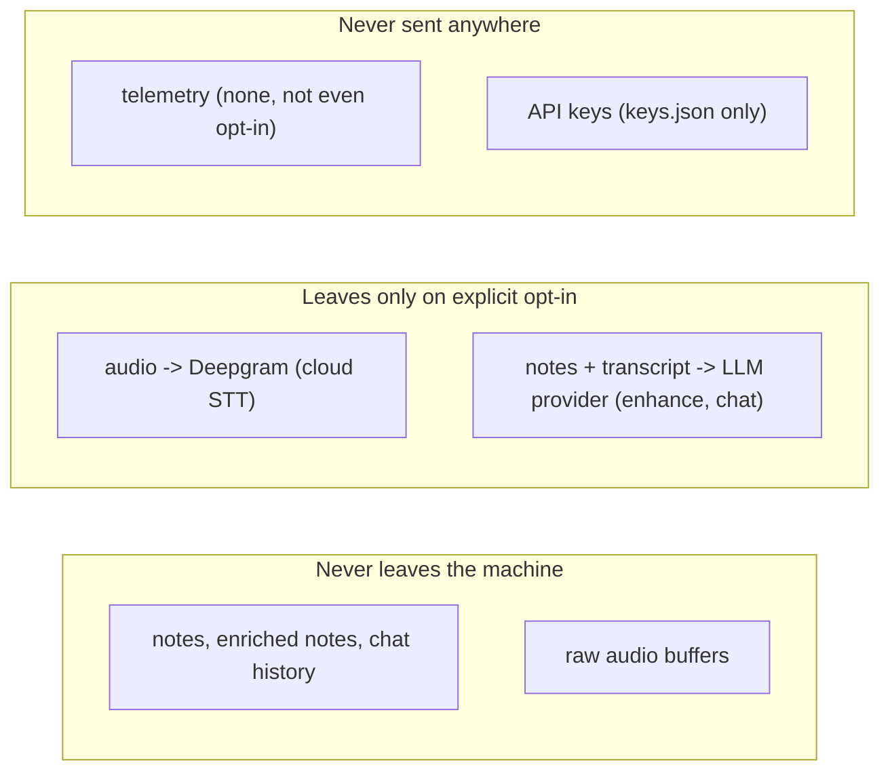

Enforcement points, all in `routes.rs` unless noted:

| Surface | Gate |
|---|---|
| `/api/health` | none |
| `/api/session-token` | Origin allowlist only (it hands out the token) |
| `/api/meetings*`, `/api/audio/*`, `/api/settings*`, `/api/stt/*` | `require_session_token` middleware |
| `/ws`, `/ws/meetings/{id}` | Origin allowlist + `?token=` (`ws.rs::enforce_ws_auth`) |
| unknown `/api/*` | explicit 404, never falls through to the SPA |
| everything else | embedded assets with SPA fallback, or Vite proxy in `--dev` |

Origin allowlist is `http://localhost:{port}` and `http://127.0.0.1:{port}`, plus the Vite origins in dev only.
Localhost binding alone is not treated as sufficient: image preloads, iframes, and link-preview SSRF can reach GETs without CORS protection, which is why even device enumeration requires the token.

Unauthenticated settings writes were a real finding, not a hypothetical: before hardening, any localhost-reaching page could POST `/api/settings/providers` and repoint the active LLM at an attacker `base_url`.

---

## 10. AI usage and cost map

Prices below were checked 2026-08-28 and are the pay-as-you-go public rates.
They move; treat the *structure* as durable and the *numbers* as a snapshot.

### 10.1 There are exactly three AI call sites

Grep-verified: `llm.complete` appears once in production code, `llm.stream` once, and `Stt::start` once.
Everything else in the app is deterministic Rust.

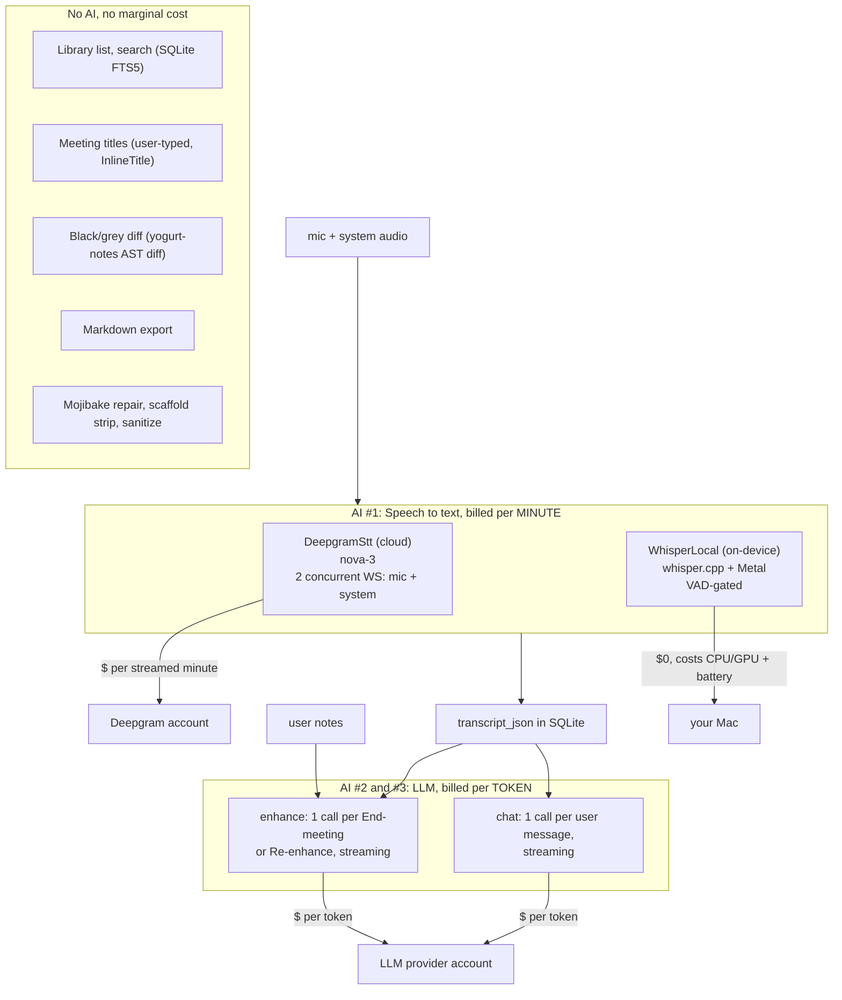

| # | Where in code | Which AI | Fires when | Billing unit |
|---|---|---|---|---|
| 1 | `meetings.rs::start` → `Stt::start` | Deepgram `nova-3` **or** local whisper.cpp | Continuously while recording | Cloud: per streamed minute. Local: free. |
| 2 | `enhance.rs:210` `llm.complete` | Configured LLM provider | Once per **End meeting**, once per **Re-enhance** | Input + output tokens |
| 3 | `api/chat.rs:218` `llm.stream` | Same provider | Once per **chat message sent** | Input + output tokens |

Fallbacks that cost nothing: if no provider is configured at all, `MockLlm` answers deterministically (`$0`).
A provider that *is* configured but whose stored key cannot be read is a hard 502, never a silent free fallback, so you can never be silently downgraded to fake output.

### 10.2 STT is where the money goes, and it bills at 2x

The mic and system channels are **two separate Deepgram WebSocket sessions** (`spawn_supervised_session` is called once for `Channel::Mic` and once for `Channel::System`).
Both stream continuously for the whole meeting, including silence, because the cloud path has no VAD gate.
Deepgram bills streamed audio duration, so:

> **Billed minutes = 2 x wall-clock meeting length**, regardless of how much anyone actually talks.

A solo meeting where nobody else is on the call still pays for the system channel streaming an hour of silence.

| Nova-3 streaming, pay-as-you-go | Per streamed min | Per 1 h meeting (2 streams = 120 min) |
|---|---|---|
| Promotional rate (current) | $0.0048 | **$0.58** |
| Standard rate (post-promo) | $0.0077 | **$0.92** |

So roughly **$0.60 to $0.90 per meeting-hour**, and a 20 h/month meeting habit is about **$12 to $18/month**.

The local path is structurally different: `vad.rs` only hands whisper.cpp segments where speech was actually detected (`MIN_SPEECH_MS` 250, `SILENCE_HANG_MS` 600, `MAX_SEGMENT_MS` 25 s), so silence costs nothing at all.
Local mic and system each get their own segmenter, and every decode runs on `spawn_blocking`.

### 10.3 The LLM calls are cheap, but one of them grows

**Enhance**, for a 1-hour meeting, sends roughly:

| Part of the prompt | Approx tokens |
|---|---|
| `enhance.md` instructions (fixed, 2.6 KB) | ~650 |
| User's sparse notes | 100 to 400 |
| `transcript_json` (see below) | ~24,000 |
| Output (the merged document) | 400 to 1,200 |

The transcript is the whole cost. It goes to the model as raw JSON, not prose, so every segment carries `{"ts_ms":3600000,"channel":"them","text":"..."}` scaffolding.
At ~700 utterances per hour that JSON punctuation alone is roughly 14k tokens on top of ~10k tokens of actual words.
The model needs `ts_ms` to emit the `data-ts` timestamps that make click-to-transcript work, so this is a real tradeoff, not waste, but it is where the tokens are.

| Provider (preset) | In / Out per 1M | Cost of one 1 h enhance |
|---|---|---|
| MiniMax-Text-01 (your `.env.local`) | $0.20 / $1.10 | **~$0.006** |
| gpt-4o-mini | $0.15 / $0.60 | **~$0.004** |
| Ollama / LM Studio | free | **$0** |

**Chat** is the line item to watch, because every message re-sends the entire transcript plus the entire prior conversation:

```
cost(message N)  =  system prompt + FULL transcript so far + all N-1 prior messages
```

There is no windowing, no truncation, and no summarization anywhere in `run_stream`.
Ten questions asked across a one-hour meeting is on the order of 120k input tokens total, about **$0.02 on MiniMax**, which is fine.
But the growth is quadratic in messages-times-meeting-length, so a long meeting with heavy chat use is the one path that can surprise you.

### 10.4 Putting it together

For one 1-hour meeting, transcribed in the cloud, enhanced once, with a handful of chat questions:

| Line item | Cost | Share |
|---|---|---|
| Deepgram nova-3, 2 streams x 60 min | $0.58 to $0.92 | **~95 to 98%** |
| Enhance, one LLM call | ~$0.005 | ~1% |
| Chat, ~10 messages | ~$0.02 | ~2 to 3% |
| Everything else (SQLite, FTS, diff, export, UI) | $0 | 0% |
| **Total** | **~$0.61 to $0.95** | |

Switch STT to local and the same meeting costs **~$0.025**.
Switch STT *and* the LLM to local (whisper.cpp + Ollama) and it costs **$0.00**, paid instead in battery, fan noise, and a one-time model download.

The one-time cost of local mode is disk and bandwidth for the model (75 MB to 3.1 GB), plus battery and thermals while decoding.
See [7.3 Choosing a model](#73-choosing-a-model) for the size table and [7.2](#72-how-local-decoding-actually-works) for why silence is free there.

### 10.5 What the architecture does and does not do about cost

Present today:

- **Local-everything escape hatch.** Both AI surfaces are behind traits (`Stt`, `LlmClient`), so `$0` mode is a settings change, not a fork.
- **Hard timeout on enhance** (`LLM_HTTP_TIMEOUT`), so a hung provider cannot bill indefinitely.
- **Backpressure detection on the STT path**, which surfaces `[stt overloaded, transcript may be lossy]` rather than silently paying for audio it dropped.
- **Deepgram model is env-overridable** (`YOGURT_DEEPGRAM_MODEL`) so you can trade quality for price without a rebuild.

Not present, in rough priority order if cost ever matters:

1. **No gating of the system channel.** It streams silence for the entire meeting at full price. Gating it on output-audio activity would cut the Deepgram bill by close to half for solo work.
2. **No transcript windowing in chat.** Every message pays for the full transcript again.
3. **No prompt caching.** The `enhance.md` prefix is fixed at ~650 tokens and the chat system prompt is stable, but neither is sent in a form that claims providers' cached-input discounts (OpenAI prices cached input at half rate).
4. **No spend meter.** Nothing in the app tells the user what a meeting cost, which for a BYO-key product is the number they would most want to see.
5. **Re-enhance is a full re-run** at full price, with no diffing against the previous result.

---

## 11. Key decisions and rejected alternatives

The stack choices that shape everything else, and what was deliberately not used.
Version truth lives in `Cargo.toml` / `web/package.json`; this section records the *why*.

### Hard constraints (violating any of these is a bug)

- **Privacy:** audio never leaves the machine unless the user opts into cloud STT, and even then only audio - never notes.
Captured audio is deleted after transcription.
API keys live only in `~/.yogurt/keys.json` (mode 0600, written atomically) - never in SQLite, never in a response body, never in a log line.
- **Single process:** audio capture, STT, LLM calls, web serving, and SQLite all run in one Rust binary.
No subprocesses, no IPC, no sidecar binaries.
- **No telemetry:** zero phone-home, not even opt-in crash reporting.
- **Platform:** macOS 13+ only - ScreenCaptureKit is the audio-loopback mechanism and sets the floor.
- **Distribution:** a single static binary; `web/dist` is embedded via `rust-embed`, SQLite is bundled via `rusqlite`.

### Rejected alternatives

| Rejected | Why | Used instead |
|---|---|---|
| Tauri / Electron / wry | Second build target, IPC layer, or a bundled Chromium - all tax the single-binary pitch for zero v1 benefit | axum serving an SPA at `localhost:7878`, opened in the user's browser |
| BlackHole / virtual audio drivers | Requires users to install kernel-adjacent software | ScreenCaptureKit system-audio loopback (the supported Apple path) |
| `getUserMedia` in the browser | Would prompt for mic permission separately from the binary's Screen Recording prompt - two confusing permission flows | All audio is captured by the Rust binary; the browser only renders UI |
| `sqlx` | Compile-time DB connection requirement is awkward inside a static-binary build | `rusqlite` with the `bundled` feature |
| Next.js / SSR React | Localhost SPA - there is nothing to server-render | React 19 + Vite, client-side only |
| Rust frontends (yew/leptos) | Debugging a Rust frontend the night before launch is a poor trade for a solo project | React + TypeScript |
| WhisperKit / CoreML / ANE | Pulls in a Swift toolchain and a model-conversion step | `whisper-rs` with the `metal` feature (GPU is fast enough on Apple Silicon) |
| Per-provider LLM SDKs | One OpenAI-compatible client covers OpenAI, Ollama, LM Studio, OpenRouter, Groq, vLLM, MiniMax, and friends | `async-openai` with a configurable `base_url` |
| macOS Keychain for API keys (`keyring` crate, used until 2026-08-29) | Keychain ACLs are bound to the binary's code signature, so every unsigned dev rebuild re-prompted once per stored key; a prompt nobody could answer wedged boot for 30+ minutes and forced 5s/10s/20s timeout scaffolding around every key read; and a machine where the user cannot write to Keychain could not run yogurt at all | `FileKeyStore` over `~/.yogurt/keys.json`: same posture as `~/.aws/credentials`, encrypted at rest by FileVault, no consent dialogs, works everywhere the data directory does |

### Load-bearing seams

- **`Stt` trait** (`yogurt-stt`): Deepgram and whisper.cpp are interchangeable behind it; swapping or adding an engine is a one-file change.
- **`rust-embed` on `web/dist`** (`yogurt-server/src/assets.rs`): the frontend must be built before the Rust build; CI does this explicitly.
- **rpath link flags in each binary crate's `build.rs`**: ScreenCaptureKit bindings need `/usr/lib/swift` on the rpath, and `cargo:rustc-link-arg` does not propagate from dependencies - see `docs/archive/superpowers/notes/2026-06-25-sck-spike-result.md` for the discovery story.
