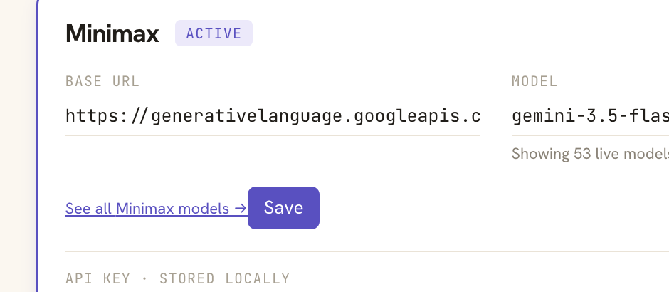

# TODO

Open work for yogurt.
Add new items at the bottom of the relevant section, or create a new section.
Keep one item per `- [ ]` line so it's easy to check off.

## Ticket IDs

Every item carries a `**<PREFIX>-<N>**` ID right after the checkbox so it can be referenced in conversation, commits, and PR titles.

| Prefix | Section |
| --- | --- |
| `UI` | UI |
| `MTG` | Meetings |
| `AUD` | Audio |
| `LLM` | LLM |
| `CLI` | CLI |

Numbers are per prefix and allocated once: the next ID is the highest existing number for that prefix plus one, counting the DONE section too.
Never reuse or renumber an ID, including when an item moves to DONE.
A new section gets a new short prefix added to the table above.

## Referencing attachments

Drop screenshots and photos in `attachments/`, then reference them inline in the TODO entry.

When the user sends a photo, save it into `attachments/` with a `YYYY-MM-DD-<slug>.<ext>` filename, then add a TODO entry that links to it.

Example entry:

```
- [ ] **UI-5** Settings modal cuts off the API key field on small windows
  <details>
  <summary>Details</summary>

  
  </details>
```

## Done items

Check off an item (`- [x]`) when the work lands; move it into the matching subsection below to keep the open work above scannable.

## UI

- [ ] **UI-5** "See all XXX models" link and Save button crowd each other on the active provider card
  <details>
  <summary>Details</summary>

  On the active provider card in Settings → LLM providers, the "See all Minimax models →" link sits right up against the Save button with barely any gap - looks like it's about to overlap, not great UX.

  
  </details>

- [ ] **UI-6** Add a dark mode toggle

## Meetings

- [ ] **MTG-10** Enhanced summary visibly flashes while streaming on longer meetings
  <details>
  <summary>Details</summary>

  Richard sees the enhanced summary pane flash and sometimes appear to get rewritten while enhance is streaming, worse the longer the meeting.

  Root cause: `enhance.rs` emits an `enhance_progress { phase: "streaming" }` WS frame roughly every 80ms (`STREAM_SNAPSHOT_INTERVAL`, `crates/yogurt-server/src/enhance.rs:388`), and each frame carries the *entire* accumulated markdown generated so far, not a delta - a deliberate choice per `docs/archive/.lavish/enhance-streaming-design.html` (self-healing on reconnect).
  On the client, `useEnhanceProgress` (`web/src/lib/ws.ts:460-479`) applies every frame with no throttling/coalescing, feeding it straight into `YogurtEditor`'s `enrichedMarkdown` prop.
  The editor's effect (`web/src/editor/index.tsx:103-112`) responds to every change by re-running `markdownToHtml` (full `MarkdownIt.render()` + `DOMPurify.sanitize()`, `web/src/editor/markdown.ts:51-55`) over the whole accumulated string, then replaces the entire ProseMirror doc via `editor.commands.setContent()` - a full parse-and-rebuild, not an append.

  Per-tick cost scales with total text generated so far, not with the size of the new chunk. For a short meeting this is cheap enough to look smooth; for a long one it eventually blows through the 80ms budget, frames queue up and land in bursts, and each full-document swap reads as a visible pop (the `[data-streaming] .ProseMirror` grey recolor and the pulsing-caret `::after`, `web/src/index.css:174-210`, also restart on every replace).

  Two directions, both revisit tradeoffs the archived design doc already weighed:
  1. Client-side: throttle/coalesce applied frames by elapsed time or text length instead of applying every WS frame, and/or move to incremental append (diff old vs new markdown, patch the ProseMirror doc) instead of full `setContent` each time.
  2. Server-side: send deltas instead of full snapshots (the design doc's rejected "Option B"), trading away the reconnect self-healing property unless deltas are paired with a periodic full resync.
  </details>

## Audio

- [ ] **AUD-2** Add NVIDIA Parakeet v3 to the local STT model download
  <details>
  <summary>Details</summary>

  The model registry at `crates/yogurt-stt/src/models.rs` only ships whisper.cpp checkpoints today (tiny.en, small.en, medium.en, large-v3), pulled by `scripts/refresh-model-hashes.sh`.
  Add Parakeet v3 as a downloadable local model - new `ModelSpec` entry, download URL, SHA256 pin, and the engine adapter if Parakeet can't reuse the whisper.cpp runtime.
  Heads-up: Parakeet is an NVIDIA NeMo checkpoint, not a ggml/gguf file - decide the engine first (NeMo ONNX export, whisper.cpp's Parakeet backend, or a new `yogurt-stt` engine next to `WhisperLocal`) before scoping this.
  Scoping research done (2026-08-29), no code yet - engine decision needed first:
  Recommendation: sherpa-onnx with a new `ParakeetLocal` engine next to `WhisperLocal` (official Rust bindings, statically linkable, ships a tested parakeet-tdt-0.6b-v3 int8 archive with a stable URL).
  parakeet.cpp is the cleanest ggml/Metal fit but has no Rust bindings and is pre-1.0 - revisit in 6-12 months.
  Open decisions before scoping: accept Apache-2.0 (sherpa-onnx) alongside MIT; its build.rs downloads a prebuilt static lib at build time; CPU-only inference needs a perf spike on Apple Silicon (no Metal path); Parakeet weights are CC-BY-4.0, so attribution may need surfacing in Settings.
  </details>

- [ ] **AUD-3** Capture more than one audio input at a time (multiple mics, or a mic plus one specific app)
  <details>
  <summary>Details</summary>

  Capture is exactly two fixed channels today: one mic device and whole-system loopback.
  `Channel` (`crates/yogurt-audio/src/frame.rs:19`) has precisely `Mic` and `System`, `spawn_mic_capture` (`crates/yogurt-audio/src/mic.rs:175`) takes a single `Option<&str>` device name, and the mid-recording hot-swap (`Registry::switch_mic_device`, `crates/yogurt-server/src/meetings.rs:709`) changes *which* single device is live, never adds a second.

  The headphones-plus-Zoom case in the ask is already covered, though: the SCK content filter is display-rooted with no window exclusions (`crates/yogurt-audio/src/system.rs:165`), so Zoom, Chrome, and everything else already land on `Channel::System` while the headphone mic lands on `Channel::Mic`. What is genuinely missing is N mics (two people at one laptop, or a USB interface alongside the built-in) and per-app system audio instead of all-or-nothing.

  Two independent halves, scope them separately:

  1. **N mic devices.** `Channel` becomes indexed rather than a two-variant enum, which ripples into the `tokio::select!` fan-in, the broadcast-sender-per-channel model, and speaker attribution in the transcript. Cheaper alternative: keep two channels and mix N devices down into `Channel::Mic` before the ring, which costs nothing downstream but throws away per-device separation. Decide which before writing code.
  2. **Per-app system audio.** `SCContentFilter` can be built app-rooted instead of display-rooted, so "just Zoom" is a filter change rather than an architecture change. Check the app-filter API is available at the macOS 13 deployment target.

  Zero-code answer that exists today: a macOS aggregate device (Audio MIDI Setup) presents N inputs to cpal as one device. Worth documenting in the README before building anything.
  </details>

- [ ] **AUD-6** Find a way to mute just the mic during a live meeting so it's excluded from the transcript, while system audio keeps recording
  <details>
  <summary>Details</summary>

  Richard wants to step away and talk to someone mid-meeting without that conversation landing in the transcript, without having to stop and restart the recording.
  This is mic-only: he'd already be muted in the meeting app itself, so the other side's audio (`Channel::System`) should keep capturing normally the whole time - only his own mic (`Channel::Mic`) needs to stop feeding the pipeline while he's talking to someone off to the side.
  Needs a pause/mute control reachable during an active recording that stops feeding mic audio into the pipeline (rather than just muting playback), and a way to see at a glance that mic capture is currently paused.
  </details>

- [ ] **AUD-7** Give an agent a live way to debug which channel (mic vs system) picked up which audio during a real meeting
  <details>
  <summary>Details</summary>

  It's not obvious today which of "me" (mic) and "them" (system) is actually capturing what, especially when Chrome is playing a video/call to simulate the other side of a meeting.
  Richard wants a workflow where he says "help me debug this meeting," an agent starts actively tailing the relevant logs/transcript, he starts the recording and plays audio through Chrome to simulate someone talking in Zoom/Slack, and the agent can narrate what it's seeing (which channel picked up the audio, timing, drops) while he narrates what he sees in the UI.
  `scripts/tail-transcript.sh` and the raw WS frames (see [docs/DEBUGGING-TRANSCRIPTS.md](DEBUGGING-TRANSCRIPTS.md)) already expose the pieces; this needs turning into something an agent can watch continuously and reason about live, not just a one-off dump.
  </details>

## LLM

## CLI

## DONE

Closed-out work, kept here for context. Move a `- [x]` item here when the work lands.

<details>
<summary>Click to expand</summary>

### UI

- [x] **UI-1** BASE URL and MODEL fields overlap on long URLs in provider cards
  <details>
  <summary>Details</summary>

  On the Settings → LLM providers page, the Google Gemini card (active) has its BASE URL value `https://generativelanguage.googleapis.com/v1beta/openai` running straight through the MODEL value `gemini-2.5-flash`. The two are visually overlaid instead of sitting side-by-side in their two grid columns.

  Root cause is in `web/src/components/settings/ProviderRow.tsx:111` — `<div className="grid grid-cols-2 gap-x-6 gap-y-3">`. Grid items default to `min-width: auto`, so a child with non-wrapping content (here the URL wrapped in `break-all` text but the inner `<code>` is still wider than its column at full URL length) refuses to shrink below its intrinsic content size and overflows into the sibling column.

  Visual evidence:
  
  </details>

  Landed in #9. `min-w-0` added to each `Field` child in the grid, in both `ProviderRow.tsx` (inactive card) and `ProviderCard.tsx` (active/edit card, whose BASE URL `<code>` was also missing `break-all`).

- [x] **UI-2** Add a "Test" button for the Deepgram key in Settings → Transcription
  <details>
  <summary>Details</summary>

  The LLM providers section has a Test button that does one live round-trip and reports a verdict inline (`web/src/components/settings/TestKeyButton.tsx`, backed by `POST /api/settings/providers/{id}/test`). The Transcription section's Cloud card has no equivalent, so a wrong or expired Deepgram key stays silent until a meeting produces no transcript, which is the worst possible time to find out.

  Two halves:

  1. Backend: a test endpoint for the STT key, alongside the existing `POST /api/settings/stt/key` in `crates/yogurt-server/src/api/settings.rs`. There is no STT equivalent of `test_provider` today. Deepgram's cheapest liveness check is probably a short authenticated request rather than opening a streaming socket; pick one that fails fast on a bad key without burning quota.
  2. Frontend: render the button on `CloudSTTCard` in `web/src/components/settings/STTPicker.tsx`. `TestKeyButton` is close to reusable as-is, but it is currently hardcoded to `settingsApi.testProvider(providerId, ...)`, so it needs the mutation passed in or a sibling component. Keep its two good behaviors: test the stored key when the input is empty, and hide the verdict once the draft no longer matches what was tested, so a green tick never sits next to edited text.

  Match the LLM card's verdict styling (matcha for ok, straw for failure) so the two sections read as one system.
  </details>

  Landed in PRs #2 and #3 (v0.2.0). The 2xx and 401 probe paths remain untested: the Deepgram URL is hardcoded, so it cannot be pointed at wiremock the way a provider's `base_url` can.

- [x] **UI-3** Chat input loses its pill shape on focus
  <details>
  <summary>Details</summary>

  The library search field stays pill-shaped when focused, with a lavender pill outline wrapping the input.
  The in-meeting "Ask this meeting..." input is also pill-shaped when collapsed, but once you click into it, the text field drops the pill background and renders as a standard rectangular input with a thick focus ring.
  It should match the search field - same pill shape on focus.

  Visual evidence:
  
  
  
  </details>

- [x] **UI-4** Thick blue ring around the AI notes section when interacting
  <details>
  <summary>Details</summary>

  In the in-meeting notes panel, typing into "your notes" leaves a heavy blue/purple border wrapped around the AI-generated content on the right.
  Same on post-meeting notes: clicking into the meeting summary section triggers the same thick ring around the whole AI area.
  Nothing is actually focused in those cases - it's a styling bug (likely `:focus-within` or panel-active state styling the wrong target).
  Remove or restyle so it doesn't read as a focus indicator.

  Visual evidence:
  
  </details>

### Meetings

- [x] **MTG-1** Live transcript comes back empty after navigating to Library and back, but a refresh restores it
  <details>
  <summary>Details</summary>

  Root-caused. The seed-on-remount machinery already exists and is correct; a token race wipes it immediately after it runs.

  `useTranscriptWs` has two effects, in this declaration order (`web/src/lib/ws.ts:209` and `:224`):

  ```ts
  // 1. seed from persisted history, guarded to fire ONCE per meetingId
  if (seededMeetingIdRef.current === meetingId) return;
  if (!seedHistory || seedHistory.length === 0) return;
  seededMeetingIdRef.current = meetingId;
  setEvents((prev) => [...seedHistory, ...prev]);

  // 2. open the WS
  if (!meetingId || !token) {
    setEvents([]);          // <- ws.ts:232
    ...
  }
  ```

  `token` is fetched asynchronously in `Meeting.tsx` (`ensureSessionToken().then(...)`), so it is `null` on the first render of every mount. Effect 2 therefore always runs its `setEvents([])` branch first time through.

  Whether that matters depends on whether `seedHistory` was ready on that same first render, and that is exactly what differs between the two paths:

  - **Client-side nav (broken).** React Query's cache is warm from the Library, so `meetingRow.transcript_json` is available on the very first render. Effect 1 seeds *and latches* `seededMeetingIdRef`. Effect 2 then runs and clears `events`. When `token` resolves a tick later, only effect 2 re-runs; effect 1's deps (`meetingId`, `seedHistory`) are unchanged, and the latched ref would short-circuit it anyway. The seed is gone for good and the dock only fills with lines that arrive after connect - the lone `Me 00:00:00 Thank you.` in the second screenshot.
  - **Hard refresh (works).** The cache is cold, so `seedHistory` is `undefined` on first render and effect 1 returns early *without* latching the ref. Effect 2 clears an already-empty list. The query resolves later, by which point the token has too, effect 1 finally fires, and the history lands.

  So the bug is not "seeding is missing", it is "seeding is destroyed by a clear that fires for the wrong reason". The clear exists to stop a previous meeting's lines bleeding into the next one, which is a `meetingId` concern, not a `token` concern. Fix: move `setEvents([])` into its own effect keyed on `meetingId` alone, and let the token gate only skip connecting. Guard against reintroducing it by asserting the ordering directly - mount the hook with `seedHistory` populated and `token` null, then supply the token, and assert the seeded events survive.

  Worth checking `MeetingPost` for the same shape while in here; it takes the same token-after-mount path.

  Live meeting before navigating away:
  

  Back from Library, dock empty except for lines that arrived after reconnect:
  

  Same meeting, still recording, after a hard refresh:
  

  Fixed: the clear moved out of the connect effect and into the seed effect, keyed on `meetingId` alone (`web/src/lib/ws.ts`), so a token arriving after mount no longer wipes the seed. Covered by a unit test on the effect ordering and by `web/e2e/live-transcript-history.spec.ts`, which drives the real Library round trip.
  </details>

- [x] **MTG-2** First "End meeting" click is a no-op while still recording; it takes two clicks to reach enhance
  <details>
  <summary>Details</summary>

  Root-caused, one-line fix. `MeetingPost` bounces straight back to the live route whenever the cached active-recording poll still names this meeting:

  ```tsx
  // web/src/routes/MeetingPost.tsx:578
  if (activeRecording.data?.id === meetingId) {
    return <Navigate to={`/meeting/${meetingId}`} replace />;
  }
  ```

  That guard exists for deep links, refresh, and the back button landing on the frozen post view for a meeting that is genuinely still recording. It cannot tell those apart from a legitimate `endMeeting` navigation, because the value it reads is stale by up to five seconds: `useActiveRecording` (`web/src/lib/api/meetings.ts:347`) polls `/api/meetings/active` on `refetchInterval: 5_000`, and `stopRecording` (`web/src/routes/Meeting.tsx:295`) invalidates only `meetingKey(meetingId)` - never `activeRecordingKey`.

  So the sequence is: `endMeeting` flushes notes, awaits `stopRecording`, navigates to `/post`, `MeetingPost` mounts against a cache that still says "recording", and `<Navigate replace>` sends the user right back. Nothing errors, nothing logs, the button just flashes.

  Both workarounds in the report follow from the same cause. A second click works because the 5 s poll has returned `null` by then; "Stop recording, then End meeting" works because the gap between the two clicks covers the staleness.

  Fix in `stopRecording`, not in the guard, so every caller is covered: `qc.setQueryData(activeRecordingKey, null)` (or invalidate it) alongside the existing `meetingKey` invalidation. Setting it directly beats invalidating, since invalidation still races the in-flight refetch. Regression test: stop, navigate to `/post` with the active-recording cache still populated, assert the route renders rather than redirecting.
  </details>

  **Landed.** `stopRecording` now writes `null` into `activeRecordingKey` itself rather than waiting for the poll (`web/src/routes/Meeting.tsx:322`). Regression test in `Meeting.test.tsx` seeds the cache the way the poll would, ends the meeting, and asserts the cache is cleared; it fails with `expected { id: 'meeting-3', … } to be null` if the line is removed.


- [x] **MTG-3** Black "your notes" vs grey AI blocks in the enhanced summary is confusing and misapplies when notes are empty
  <details>
  <summary>Details</summary>

  The post-meeting enhanced summary color-tints each block by source: `Source::User` blocks render black ("your notes"), `Source::AiGrey` blocks render grey with a transcript deep-link (`crates/yogurt-notes/src/render.rs` wraps them in `<span data-ai-grey data-ts="N">`).
  When the user's notes are empty, the expectation is that everything in the enhanced AI summary is grey AI output.
  Observed instead: the whole summary reads as black "your notes", so the grey/black distinction feels broken or inverted.

  Two things to do:
  1. Clarify and document how the black-vs-grey split is actually supposed to work (what makes a block `User` vs `AiGrey` - see `crates/yogurt-notes/src/diff.rs` for the user/AI merge rules), and confirm the intended mapping against the frontend styling.
  2. Fix the mismatch: when the user has no notes (`user_notes` empty), the merged doc should come out all `AiGrey` (all grey) - if it's rendering black instead, find where blocks are being tagged `Source::User` when there was no user input to attribute to them.

  Verify E2E: record a meeting with no notes typed, enhance, and confirm every block in the summary is grey; then type notes and confirm those specific blocks render black while AI additions stay grey.

  Resolved 2026-08-30. Two root causes:
  1. Frontend: the `aiGrey` promote-on-edit plugin (`web/src/editor/marks/aiGrey.ts`) treated TipTap's programmatic `setContent(html, false)` replace as one giant user insertion and stripped the grey mark from the entire document on every post-view load, Re-enhance, and tab switch. It now skips transactions carrying TipTap's `preventUpdate` meta.
  2. Backend: `crates/yogurt-notes/src/render.rs` never marked AI headings (and h1/h3 fell through to the paragraph branch), so with empty notes the inferred headings always read as ink "your notes". AI headings are now wrapped in `<span data-ai-grey>` (no deep-link).
  Contract, as documented in `render.rs`: a block is black only when `diff::merge` finds its text in the user's own notes; everything else the LLM produced is grey, headings included.
  </details>

- [x] **MTG-4** Add an "enhanced with" pill next to the existing STT pill on meeting headers
  <details>
  <summary>Details</summary>

  `MeetingMetaPills` (`web/src/components/MeetingMetaPills.tsx`) already shows a `[Local · small.en]` / `[Cloud · nova-2]` pill for the STT engine, stamped at recording start.
  Mirror that for the LLM: when a meeting has been enhanced (or is in the middle of being enhanced), surface an `[Enhanced with · gpt-5-mini]` (or `Local · llama-3` / etc.) pill in the same row so users know which model fused their notes with the transcript.

  Shape to match the existing pill: `parseSttEngine`-style splitter, `Local` (matcha) vs `Cloud` (blue) tones, `Sparkles`/`Cloud`/`HardDrive` lucide glyph, neutral when no LLM ran yet.

  Backend: stamp `llm_enhancement` on the meeting row when enhance kicks off (parallel to `stt_engine` at recording start) - something like `"local · qwen2.5-7b"` or `"cloud · claude-haiku-4-5"`. Persist the same shape used today for STT so the pill code can share parsing.
  Render the pill only after enhance has actually run (or is in flight) - a meeting that was recorded but never enhanced should show only the STT pill, not a guessed LLM pill.
  Library card (`MeetingCard`) already reuses `MeetingMetaPills` - it should pick this up for free once the row carries the new column.

  Verify E2E: record → enhance locally with a known model → confirm the pill appears in the post-meeting header, the library card, and during a re-enhance with a different model the pill updates to the new one.

  Done 2026-08-29.
  Reused the existing `meetings.llm_model` column (V008, bare model name stamped by enhance.rs) instead of a new `llm_enhancement` column, and skipped the local/cloud split: the LLM is always a BYO OpenAI-compatible endpoint, so the app has no local-vs-cloud signal to key a tone on.
  `LlmPill` (`Sparkles` glyph, blueberry tone, `Enhanced · <model>`) sits next to `EnginePill` in the live header, post-meeting header, and library card; `POST /enhance` now returns `llm_model` so the post-meeting pill follows a re-enhance without a refetch.
  Verified in the browser against a real MiniMax enhance; a failed enhance keeps the previous stamp.
  </details>

- [x] **MTG-5** LLM pill missing on a live meeting (STT pill shows, LLM pill doesn't)
  <details>
  <summary>Details</summary>

  Starting a new meeting showed the STT pill but no LLM pill.
  Not a bug in the pill: `stt_engine` is stamped on the row at recording start (`routes.rs::start_meeting`), while `llm_model` is only stamped by `enhance.rs` after a successful enhance, so a live meeting has nothing to render and `LlmPill` correctly refuses to guess.

  Fixed 2026-08-30 in the live header only (`web/src/routes/Meeting.tsx`): when the row has no `llm_model`, fall back to the active provider's model from the already-cached `useSettings()`, mirroring the existing `stt_engine ?? activeRecording.stt` fallback.
  `MeetingMetaPills` grew an `llmPending` flag that flips the pill's tooltip to "Will enhance with <model>" so a pre-enhance pill doesn't claim the meeting was already enhanced.
  Post-meeting header and library card are untouched - a stored meeting that was never enhanced still shows no pill.
  Verified E2E against the running backend: "+ New meeting" now renders `[Local · large-v3-turbo] [MiniMax-M3]` while recording.
  </details>

- [x] **MTG-6** Short / empty post-meeting meetings should say "too short" and return to the library
  <details>
  <summary>Details</summary>

  When a meeting ends but has nothing meaningful to transcribe or enhance (very short duration, mostly silence, audio captured but no usable content), the post-meeting view runs enhance on near-empty input today.
  Detect this case and surface a clear "Meeting too short" state instead of producing augmented notes from nothing.
  Auto-return to the library (home screen) so the user isn't left in a blank post-meeting view they have to navigate out of manually.
  </details>

- [x] **MTG-7** Delete-confirm check should overlay, not shift the post-meeting topbar
  <details>
  <summary>Details</summary>

  In the post-meeting view, clicking the trashcan button shows the confirm checkmark inline, which then pushes the Enhance button and the rest of the top bar around (format/visual layout changes mid-click).
  Make the confirm step overlay-anchored under the trashcan (floating popover) instead of taking up flow space, so the topbar stays put.

  Visual evidence:
  
  
  </details>

- [x] **MTG-8** Live transcript duplicates when audio plays through the machine
  <details>
  <summary>Details</summary>

  During a live meeting, audio played on the Mac (system-audio playback, video with speech, etc.) shows up in the live transcript as duplicates rather than once.
  Root cause likely lives between `crates/yogurt-audio`'s mic and ScreenCaptureKit channels (acoustic echo into the mic plus digital capture, or an internal double-publish) - investigate and de-dupe.

  Visual evidence:
  
  </details>

- [x] **MTG-9** Make a meeting's summary/transcript discoverable by an agent from just its URL
  <details>
  <summary>Details</summary>

  Richard wants to hand an agent (Claude Code or otherwise) a link like `http://127.0.0.1:7878/meeting/<id>/post` and have it know where to look: pull the summary first since it's cheap, then fetch the full transcript only if it needs more detail.

  Today that requires knowing the internal shape - `GET /api/meetings/{id}` for the row (`enriched_md` is the AI summary, `transcript_json` the raw transcript) or `GET /api/meetings/{id}/markdown` for the on-disk export - and both sit behind `routes::require_session_token`.

  No auth story needed for this, though: everything here is local reads against `localhost:7878` / `~/.yogurt/`, nothing leaves the machine, so this is a read tool, not an API client. Two ways to build it, both skip the session token entirely:

  1. A skill (`.claude/skills/`) that knows the URL pattern, extracts the meeting ID, and reads the on-disk markdown export directly - already positioned as the "grep-able source of truth" per the doc comment in `crates/yogurt-server/src/api/meetings.rs:16-22` - falling back to `transcript_json` in SQLite for the raw transcript when the markdown summary isn't enough.
  2. A `yogurt meeting <id> --summary` / `--transcript` CLI subcommand doing the same lookup, useful for non-Claude agents too.

  Either way: parse the ID out of the URL, summary first, transcript only on request.
  </details>

  Done 2026-08-31. No server code: every mechanism the ticket asks for already existed, so this was a discoverability fix in the two places an agent actually looks.

  The "summary first, cheap" endpoint is `GET /:id/markdown` - it serves the canonical `~/.yogurt/notes/*.md` bytes, whose body is `enriched_md ?? notes_md` and carries no transcript. Measured on a real meeting: 849 bytes against 7,864 for `GET /api/meetings/:id`, which bundles the summary and the raw transcript in one payload and so cannot answer "summary only" at all. The transcript stays on the row and gets filtered out client-side with `jq`, so only the transcript reaches the agent's context.

  Option 2 (a `yogurt meeting <id>` subcommand) was not built. It would be new Rust re-deriving what one `curl` already returns, and `yogurt-cli` has only `start` and `doctor` today. Worth revisiting only for a non-Claude agent that cannot shell out to `curl`.

  Two things the scoping turned up that the entry did not anticipate:
  - The markdown export is wrapped in `<span data-ai-grey …>` tags from the MTG-3 grey-tinting renderer. They mean nothing outside the browser and roughly double the byte count, so the documented recipe pipes through `sed -E 's/<[^>]+>//g'`, which leaves the `↳ mm:ss` transcript deep-links readable.
  - The on-disk fallback must match the front-matter `id:`, not the filename. Meeting ids are UUIDv7 and therefore time-ordered, so the `-<id6>` suffix in `<date>-<slug>-<id6>.md` is not unique - three files in the local notes dir share `01a05a`.

  Landed as: `docs/AI-INTEGRATION.md` "Read what got captured" rewritten around URL -> id parsing and summary-first ordering, and `.claude/skills/yogurt-control/SKILL.md` extended to cover reading (its description now triggers on a pasted meeting URL, not just start/stop). Both take the port from the URL rather than hardcoding 7878, since `just dev` moves the backend for a second worktree (CLI-3).

  `README.md` gained an "Ask an agent about a meeting" section, because the skill lives at `.claude/skills/` and yogurt ships as a brew binary - so the people MTG-9 was written for never clone the repo and would never see it.

  Install is `npx skills add jarvisrchen/yogurt --skill yogurt-control --global` (`skills`, from `vercel-labs/skills`). This needs **no repo changes at all**: `.claude/skills` is already in that CLI's `AGENT_PROJECT_SKILL_DIRS`, so it discovers yogurt's skills straight out of the existing layout with no manifest. Verified against the real repo before writing the docs - `--list` on `main` found both `release` and `yogurt-control`, and a sandboxed-`HOME` install put one copy at `~/.agents/skills/yogurt-control` with `~/.claude/skills/yogurt-control` symlinked at it, so all 77 supported agents share a single source of truth.

  The README pins `--skill yogurt-control` on purpose: the repo also ships the contributor-only `release` skill (tags a version, merges the Homebrew tap PR), and an unpinned install would hand every yogurt user a release-cutting skill they cannot use. A hand `curl` into `~/.claude/skills/` or `~/.codex/skills/` is kept as the no-Node fallback; Codex uses the identical `SKILL.md` frontmatter, so it is one file for both, and `curl -fsSL -o` exits non-zero and writes nothing on a 404 so a bad URL cannot half-install a broken skill.

  Deliberately not built: per-agent plugin manifests. Claude Code reads `.claude-plugin/marketplace.json` and Codex reads `.agents/plugins/marketplace.json` (different schema), and Cursor/Windsurf/Gemini/opencode each want their own wrapper - ponytail ships eight such copies of one skill's text. The `skills` CLI makes all of that unnecessary here.


### Audio

- [x] **AUD-1** Live partials shrink mid-sentence on local STT, and never appear at all for system audio
  <details>
  <summary>Details</summary>

  Two symptoms, one cause each, both in the local whisper.cpp partial ticker (`crates/yogurt-stt/src/whisper_local.rs:261`). Deepgram is not involved; `ts_ms 00:00:00` on the in-flight line in the first screenshot is the local ticker's hardcoded `ts_ms: 0`, which is how you tell which engine produced a partial.

  **Partials shrink as you keep talking.** The ticker decodes a *rolling 5-second* buffer:

  ```rust
  // crates/yogurt-stt/src/whisper_local.rs:348
  let max = 16_000 * 5;
  if buf.len() > max {
      let excess = buf.len() - max;
      buf.drain(..excess);
  }
  ```

  Every 1 s tick re-decodes only the last 5 s of audio and emits the result as a whole-line replacement, so once an utterance passes five seconds the earliest words scroll out of the window and the displayed partial gets *shorter*. It reads as the transcript eating itself. The final is unaffected because it comes from a different path - the VAD segmenter, good for up to `MAX_SEGMENT_MS = 25_000` (`crates/yogurt-stt/src/vad.rs:63`) - which is why the full sentence reappears the moment you pause.

  Deepgram does not have this bug: `fold_deepgram_event` accumulates window-finals in `UtteranceState.buf` and emits `join_words(&st.buf, &transcript)`, so its partials only ever grow. The local ticker keeps no equivalent buffer.

  Fix direction: make the partial cumulative within the current VAD segment rather than a fixed rolling window - clear `partial_buf` on segment emit and let it grow to `MAX_SEGMENT_MS` - and cap decode cost by re-decoding at a coarser interval as the buffer grows, rather than by dropping audio. Confirm the decode stays inside the 1 s tick budget at 25 s of audio before committing to it; if it does not, the fallback is to keep the rolling window but emit an append-only delta rather than replacing the line.

  
  

  **No partials at all on headphones.** The ticker is mic-only by design: *"Skipped for system audio in v1 to halve whisper.cpp pressure - PRD §13 only requires the still-listening indicator on the user's own voice."* `Channel::System` therefore has no partial path and only ever renders VAD-segment finals, which is the reported "shows in chunks after each sentence".

  This also explains why the report says the bug only happens on the Mac speaker. On speakers the mic re-captures the speaker output, so the meeting audio lands on `Channel::Mic` *as well* and picks up the ticker - visible in the first screenshot as `Me` and `Them` carrying identical text at `00:01:51`. On headphones there is no bleed, the far end exists only on `Channel::System`, and the streaming indicator disappears. The mystery in the report ("I don't know how it's getting the audio at all") is just system loopback: SCK capture is independent of the output device.

  Decide whether the v1 mic-only tradeoff still holds now that the asymmetry is user-visible. Enabling the ticker for `Channel::System` doubles whisper.cpp pressure, so it needs a perf spike on the smaller models first. The echo-bleed duplicate lines are a separate issue - worth its own entry if it bothers you beyond this bug.

  Done 2026-08-31.
  Both symptoms were one cause: the ticker kept its own rolling 5 s window over raw mic audio, parallel to the utterance buffer `Segmenter` already maintains.
  It now reads `Segmenter::pending()` instead - the in-flight utterance, cleared on segment emit, bounded by `MAX_SEGMENT_MS` - so "partials only ever grow" is structural rather than a rule the ticker has to follow, and the mic-only wiring disappeared with the window.
  System partials are on: the ticker round-robins the two channels and decodes only the one with an utterance in flight, so whisper.cpp pressure is unchanged at one greedy decode per tick rather than doubled. Only the refresh rate gives, and only while both people talk at once (2 s per side instead of 1 s).
  The perf spike the entry asked for is committed as `crates/yogurt-stt/examples/partial_decode_cost.rs`: on large-v3-turbo a full 25 s buffer decodes in ~585 ms, against a 1 s tick, because whisper.cpp pads every input to a 30 s mel window and the encoder cost therefore does not scale with buffer length.
  Partials also carry the utterance's real `start_ms` now, matching what the deepgram adapter already did, so the in-flight line stops rendering as `00:00:00` and the timestamp no longer jumps when the final replaces it.
  Design: `docs/.planning/aud1-live-partials-design.md`. Verified before/after by driving the real `WhisperLocal::start` with 45 s of speech on both channels: on `main` the partial peaked at 95 chars then shrank to 60 as leading words fell out of the window, with no system partials at all; after, both channels grow monotonically to 400+ chars and reset cleanly on each final.
  </details>

- [x] **AUD-4** Ship a local STT model with the release instead of downloading from HuggingFace on first run
  <details>
  <summary>Details</summary>

  Every entry in `REGISTRY` (`crates/yogurt-stt/src/models.rs`) pointed at `huggingface.co/ggerganov/whisper.cpp`, so first-run local STT needed HF reachable - a locked-down machine could install yogurt and still not transcribe.

  Licensing was not the blocker: the HF repo's card reports `license: mit` and the upstream OpenAI weights are MIT, so redistribution is fine (attribution lives in `THIRD_PARTY_LICENSES.md`, hand-written since model weights aren't crates).

  ### Decisions

  - **Mirror `small.en` first, not `tiny.en`.** The shipped default is `small.en` (`V005__stt_provider_model.sql` seeds it, `settings.rs` falls back to it).
  - **One immutable `models-v1` release tag, not a per-release asset.** The bytes are pinned by SHA256 (`download_to` hard-fails on mismatch), so per-tag URLs would buy nothing the hash doesn't already guarantee. A tag that never moves keeps old binaries resolving.
  - **Delivery is a companion Homebrew formula, not a bigger main formula.** `brew install yogurt` stays 11.7 MB for cloud-STT users; opt-in is a second formula per model, `brew install jarvisrchen/yogurt/yogurt-model-<name>`.
  - **HuggingFace stays as a fallback, ordered second.** The mirror is a mirror, not a new source of truth.
  - **`large-v3` is not mirrored.** At 2.88 GiB it's over GitHub's 2 GiB release asset cap; the other four (tiny.en, small.en, medium.en, large-v3-turbo) all fit.

  Done 2026-08-31.
  All three remaining pieces landed:
  - `./scripts/publish-model-mirror.sh` uploaded the four mirrorable models to the `models-v1` GitHub release, each verified against the `models.rs`-pinned SHA256 before publishing.
  - The tap (`jarvisrchen/homebrew-yogurt` PR #4) gained the four `yogurt-model-*` formulae via `./scripts/render-model-formula.sh <name>`, each writing its own `.sha256` sidecar at install time so `list_models` never re-hashes a Homebrew-owned copy.
  - `ModelSpec` gained `mirror_url: Option<&'static str>`, pinned to the GitHub release asset for the four mirrorable models (`None` for `large-v3`). `download()` now tries `mirror_url` before `url`, so the in-app download button also stops depending on HuggingFace reachability. Fallback-order behavior is covered by unit tests against an in-process mock server (`crates/yogurt-stt/src/models.rs`, `mod tests`).

  Not solved by any of this: air-gapped machines, and `large-v3` on an HF-blocked network. Both already have a workaround - `is_downloaded_at` only checks the hash, so a model copied into `~/.yogurt/models/` by any means is accepted.

  Side finding from scoping: `scripts/refresh-model-hashes.sh` used to download 5.2 GB to learn hashes that HuggingFace serves as text - `GET /<repo>/raw/main/<file>` returns the Git LFS pointer, whose `oid sha256` is the blob's hash, for about 5 KB of traffic instead.
  </details>

- [x] **AUD-5** Add the ability to delete a downloaded local STT model
  <details>
  <summary>Details</summary>

  The Settings → Local whisper.cpp panel lists every model with a `✓` + size when it's already downloaded under `~/.yogurt/models/`, but offers no way to remove one.
  Case in point: `large-v3` is sitting at 3.0 GB on disk and the only way to reclaim that space today is `rm -rf` by hand.
  Add a delete affordance per downloaded chip - probably a trash/X icon on hover, with a confirm step (matching the post-meeting trashcan UX) so a stray click doesn't nuke a 1.6 GB model.
  Backend: new `DELETE /api/local-stt/models/:name` that removes the directory + SHA-pinned file, returns the freed bytes, and rejects if the model is the currently active one (force the user to switch first).
  Frontend: invalidate the model list query so the chip flips back to "download" state and the size badge clears.

  Done 2026-08-29.
  Backend: the existing `DELETE /api/stt/models/{name}` now 409s when the model is the active local one, does the fs work on the blocking pool, and returns `200 {freed_bytes}` (idempotent, 0 if already gone).
  Frontend: trash icon next to every downloaded, non-active pill in `ModelPicker`, inline `Delete? / Cancel` confirm that auto-reverts after 3s, and a transient `Deleted <name> - freed <size>` line under the picker. Verified E2E in a sandboxed `$HOME` against a real `small.en` copy.
  </details>

### CLI

- [x] **CLI-3** `just dev` should pick a free port pair so two worktrees can run at once
  <details>
  <summary>Details</summary>

  Everything about the dev loop assumed one instance: `vite.config.ts` hard-coded `5173` (server port, HMR client port, and the `/api` + `/ws` proxy targets to `7878`), `run-frontend.sh` refused to start on any other port ("the backend proxy is hard-coded to 5173"), and `allowed_origins` in `ws.rs` hard-coded the `5173` dev origin. Running a branch therefore meant stopping whatever was already running, which is exactly backwards when the point of a worktree is to have two branches side by side.

  Only the *port* was hard-coded, not the plumbing - the binary already read `YOGURT_VITE_BASE` for its proxy target and already took `--port`. So the fix is to thread one pair of numbers through:

  - `just dev` resolves both ports up front (default policy `next` rather than `ask`: the usual reason `:7878` is busy is another worktree) and exports `YOGURT_VITE_PORT`, `YOGURT_BACKEND_PORT`, `YOGURT_VITE_BASE` for both scripts.
  - `vite.config.ts` reads both, for its own port, its HMR client port, and its `/api` + `/ws` proxy targets.
  - `run-frontend.sh` lost the 5173-only bail; `run-backend.sh` derives `YOGURT_VITE_BASE` from the port when it is not set and prints the target it will proxy to.
  - `allowed_origins` follows Vite's actual port, so the WS handshake works on the moved pair and still rejects the *other* worktree's origin.
  - Playwright got its own port (5199) - `reuseExistingServer` is on locally, so sharing 5173 meant a run could silently pass against whatever worktree was serving there.

  Verified with two instances at once: an existing `just dev` on 5173/7878, then `just dev` from a second worktree, which took 5174/7879 with no prompt. Both served their SPA, and the WS handshake against 7879 returned 101 for `localhost:7879` and `localhost:5174`, 403 for `localhost:5173` (the other worktree) and for a junk origin.

  Not addressed: both instances still share `~/.yogurt/` (one SQLite, one keys file, one models dir), so they see the same meetings and only one should record at a time. A `YOGURT_DATA_DIR` override is the fix if that ever bites.
  </details>

- [x] **CLI-2** Audio lag warnings spam the terminal on a normal meeting; move them behind `RUST_LOG`
  <details>
  <summary>Details</summary>

  Left open by CLI-1, which kept them at `warn!` on the theory that dropped audio is signal. In practice every meeting opens with a burst of them and there is nothing to act on:

  ```
  WARN whisper_rs::ggml_logging_hook: ggml_metal_device_init: tensor API disabled for pre-M5 and pre-A19 devices
  WARN yogurt_server::meetings: audio adapter: system lagged n=220
  WARN yogurt_server::meetings: audio adapter: mic lagged n=218
  WARN yogurt_stt::whisper_local: whisper_local audio rx lagged; dropping n=131
  ... 10 more in the same millisecond
  ```

  All of it lands in one burst while the STT engine loads its model and the ring buffers catch up, then nothing for the rest of the meeting.

  Two changes:

  1. The three lag sites (`audio adapter: mic lagged`, `audio adapter: system lagged`, `whisper_local audio rx lagged`) are `debug!` now, so `RUST_LOG=yogurt=debug` still gets them. The transcript relay and persistence lag warnings keep their level - those are dropped *transcript*, not dropped audio frames, and they do not fire routinely.
  2. Default filter is `yogurt=info,whisper_rs=error` (was `whisper_rs=warn`). The only whisper WARN that ever shows is ggml's `tensor API disabled for pre-M5 and pre-A19 devices`, a hardware-capability note on every model load. Decode failures are ERROR and still surface, plus the UI's `stt_error` banner.

  Verified against a real local-STT meeting (`large-v3-turbo`, mic + system capture, 6 transcript segments): start, record, stop is 6 lines and 0 warnings. The burst itself is load-dependent and did not recur in the verification run (warm model), so what the run proves is the level swap and a quiet terminal, not the burst being caught in the act.

  If lag ever turns sustained rather than a startup artifact, the fix is a periodic count, not a line per event - noted at the call site.
  </details>

- [x] **CLI-1** Quiet the terminal during a live meeting; keep lifecycle lines and errors, drop the rest
  <details>
  <summary>Details</summary>

  `yogurt start` should read as a status line, not a firehose. The wanted set is roughly: server up and its URL, meeting started, meeting stopped, enhance started and finished, and anything that actually went wrong. Everything else belongs behind `RUST_LOG`.

  While in here, the default filter is `"yogurt=info,yogurt_server=info"` (`crates/yogurt-cli/src/main.rs:79`). `EnvFilter` matches targets by plain `starts_with` (tracing-subscriber 0.3.23, `filter/env/directive.rs:246`), so `yogurt=info` already covers `yogurt_server`, `yogurt_audio`, `yogurt_stt`, and every other `yogurt_*` crate. The second half is redundant and reads as if it were doing something. Drop it, or replace both with per-crate levels once the noisy targets are known.

  Careful not to overshoot: the point is a quiet terminal that still proves the thing is working, so lifecycle lines stay at `info!` and everything currently at `warn!`/`error!` keeps its level. Demote to `debug!` rather than delete, so `RUST_LOG=yogurt=debug` still gets you the detail when something needs diagnosing.
  
  **Landed.** Measured before fixing: whisper.cpp and ggml write 45 lines to stderr on model load and another 17 on *every* decode, through ggml's own log callback - which `params.set_print_*(false)` does not control, because those only govern whisper's transcript printing. With the partial ticker decoding once a second, a three-minute local-STT meeting emitted roughly 3,000 lines.

  Three changes:

  1. `whisper_rs::install_logging_hooks()` in `WhisperLocal::load`, plus the `tracing_backend` feature on the `whisper-rs` dep, so the C-side stream goes into `tracing` instead of straight to stderr.
  2. Default filter is now `yogurt=info,whisper_rs=warn` - ggml's INFO banners are dropped, its warnings and errors still surface, and `RUST_LOG=whisper_rs=debug` brings the detail back.
  3. Added the lifecycle lines that were missing entirely (`meeting_started` with provider and model, `meeting_stopped`, `enhance_complete` with model and elapsed, `enhance_skipped_too_short`) and demoted per-socket and teardown chatter in `meetings.rs`/`ws.rs` to `debug!`.

  Verified end to end against a real local-STT meeting on `large-v3-turbo`: start, record, stop, enhance now produces 13 lines total.

  Not addressed: the `audio adapter: * lagged` / `whisper_local audio rx lagged` warnings still fire un-throttled. In the verification run they came as one 270 ms burst at startup and nothing for the remaining 2.5 minutes, so they are signal about genuinely dropped audio rather than a firehose. Collapsing them to a periodic count is worth doing if they ever turn sustained.
  </details>

### LLM

- [x] **LLM-7** Add an OpenCode local-CLI provider preset
  <details>
  <summary>Details</summary>

  Third `adapter: "cli"` preset alongside Claude Code and Cursor Agent, defaulting to `minimax-coding-plan/MiniMax-M3`. Same shape as the other two - no base URL, no key, a `Test` that runs a real completion, and a MODEL field whose `Refresh` asks the binary. `opencode models` returns 370 ids on a live account (every model of every provider the user has configured), so the preset ships one static suggestion and Refresh does the rest.

  Two things made this more than an entry in `PRESETS`.

  `opencode` does not speak the `-p --output-format json` shape. `opencode run --format json` prints JSON LINES - the answer as `type: "text"` parts, thinking as `type: "reasoning"`, a failure as `type: "error"` - so `interpret_output` now dispatches on `CliProgram` rather than assuming one object with `result`/`is_error`. Text is keyed by `part.id` so a future switch to streamed snapshots can't duplicate the answer's prefix; `reasoning` is dropped, since the model's scratchpad is not its reply. `parse_model_list` handles both catalog formats (`<id> - <label>` from cursor-agent, bare `<provider>/<model>` from opencode) with one pass.

  The containment is the part worth remembering. `--auto` is opencode's `--dangerously-skip-permissions` and is the flag a user reaches for to make `run` non-interactive - it must never be passed here. Beyond that, a bare `opencode run` loads the user's global config: verified live, the model was offered `google-workspace_send_gmail_message`, `google-workspace_search_gmail_messages` and Drive writes, which is a working exfiltration path for a transcript that says "email yourself the following". `OPENCODE_CONFIG_CONTENT={}` does NOT close it. `OPENCODE_PERMISSION={"*":"deny"}` does, by removing every tool from the model's schema - 35k input tokens down to 2.2k on the same prompt, and an order to run `echo` comes back as prose about running it rather than a `tool_use` event. `--pure` drops third-party plugins on top.

  Verified end-to-end against the live binary through the real API: preset advertised, provider cloned, Refresh returns 370 with the default present, `Test` returns `{"ok":true,"model":"cli:opencode:minimax-coding-plan/MiniMax-M3"}` in ~4 s, and a bogus `cli_model` surfaces opencode's own error text rather than an exit code.
  </details>

- [x] **LLM-6** Fetch the model list for a CLI provider instead of shipping one static suggestion
  <details>
  <summary>Details</summary>

  The Cursor Agent CLI provider only ever suggested `auto`, so a paid-plan user had no way to discover the ~200 model ids `--model` actually accepts without leaving Settings and running the CLI themselves. `claude`'s four aliases are the whole catalog and stay static; `cursor-agent` has a `--list-models` flag and needs asking.

  `POST /api/settings/providers/{id}/models` now handles `cli` rows by spawning `<binary> --list-models` and parsing its `<id> - <label>` lines, and the CLI branch of `ProviderCard`/`ProviderRow` renders the shared `ModelSelect` (dropdown + `Refresh`) instead of a bare `ComboBox`, so it gets the same affordance the HTTP rows have had.

  A listing does NOT prove entitlement, and the UI deliberately does not pretend otherwise. Verified live: a free-tier Cursor account lists all 204 ids and then refuses every named one at call time with `ActionRequiredError: Named models unavailable Free plans can only use Auto. Switch to Auto or upgrade plans to continue.` So `Test` stays the only signal for "can this account actually use this model", and its error text already tells the user to go back to `auto`. Pre-filtering the dropdown would have meant spending a real completion per Refresh to learn something `Test` reports for free.

  `claude` has no such flag, so Refresh on it returns 422 ("no model catalog to refresh") - distinct from the 502 a real probe failure (not logged in, binary gone) produces, so the UI can keep showing the static aliases in the first case.
  </details>

- [x] **LLM-5** Enhance times out on CLI providers whose model ignores `--effort low`
  <details>
  <summary>Details</summary>

  Selecting `haiku` as the Claude Code CLI provider's model makes every enhance fail with `llm call exceeded 60s timeout`. `sonnet` on the identical prompt is fine. Reproduced against a real 94 s meeting (`01a05a46-d9d0-78c1-b88f-5269955516c0`), running `crates/yogurt-llm/src/cli.rs`'s exact argv by hand:

  | model | wall | output tokens | thinking tokens | result |
  | --- | ---: | ---: | ---: | ---: |
  | sonnet, `--effort low` | 4.2 s | 126 | 0 | 314 chars |
  | haiku, `--effort low` | 94 s | 10100 | 9983 | 305 chars |
  | haiku, no `--effort` | 77 s | 7550 | 7466 | 211 chars |

  Three separate problems, all of which have to be fixed for this to stop biting:

  **1. `--effort low` is assumed to be sufficient, and silently is not.** `build_args` passes it unconditionally, justified in its own comment as "extraction calls, not reasoning tasks - low effort is faster and cheaper with no real quality loss ... there's no scenario here that benefits from spending more". Sonnet honours it and emits 0 thinking tokens. Haiku ignores it and spends ~10k thinking tokens on a prompt whose answer is 300 characters. Dropping the flag changes nothing (row 3), so the flag is not the lever - and there is no thinking-budget flag on the CLI at all (`claude --help` offers only `--effort` and `--max-budget-usd`).

  **2. The CLI adapter borrows a timeout sized for a different job.** `CLI_TIMEOUT` is `crate::HTTP_TIMEOUT`, and `enhance.rs` separately wraps `llm.stream()` in the same 60 s. For an HTTP provider that budget covers *opening* a stream - headers only - and a long healthy generation then runs on the per-chunk idle timeout instead. But `CliClient::stream` does not stream: it runs `complete()` to completion and replays the whole answer as one delta (`// v1 scope (LLM-4): no --output-format stream-json parsing yet`). So the same 60 s has to cover *full generation*. Even sonnet on a 60-minute meeting already burns 17.6 s of it, so the margin is thin for everyone, not just haiku.

  **3. The failure is illegible.** A model that is merely slow presents as a hang, then a generic "LLM timed out" banner naming no model and offering no remedy. Nothing points at the model choice, which is what made this take a full debugging session to pin down.

  Worth noting the cost inversion, because it undercuts the obvious "just pick the cheap fast model" instinct: haiku here is ~20x slower **and** more expensive than sonnet (10100 output tokens vs 126) for an equivalent answer.

  Done 2026-09-01 (#24).
  The budget moved onto the trait as `LlmClient::response_timeout`, because only the implementation knows what its own await points cost: HTTP keeps the 60 s handshake figure, `CliClient` returns `GENERATION_TIMEOUT` (300 s), and `enhance.rs` asks the client instead of hardcoding a constant for either the open or the per-chunk idle wait.
  `CLI_TIMEOUT` stays as the inner bound on a wedged subprocess, now sized off `GENERATION_TIMEOUT` so it cannot preempt the caller; the dead `LLM_HTTP_TIMEOUT` is gone.
  `--effort low` is still sent - it genuinely helps the models that honour it - but is now documented as advisory rather than relied on as a cap.
  The timeout message names the model and points at Settings, since a timeout here is far more often "this model is slow for this prompt" than "the provider is down".
  Verified end to end against the running app with `haiku` still configured, on the meeting that was failing: HTTP 200 in 1:53 (`llm_model: cli:claude:haiku`), where before it died at 60 s every time.
  Still slow, because nothing available can cap haiku's thinking - but slow now reads as slow instead of broken.
  </details>

- [x] **LLM-1** Route LLM calls through a local agent CLI (`claude -p`, `cursor-agent`) when no API endpoint is reachable
  <details>
  <summary>Details</summary>

  `LlmClient` (`crates/yogurt-llm/src/lib.rs:49`) is already the right seam: two methods, `complete` and `stream`, and the crate doc at line 12 anticipates a second implementation. A `CliClient` that spawns the agent CLI and implements the same trait needs no changes above it.

  It cannot be just another provider row with a different base URL. `OpenAiClient::new` (`crates/yogurt-llm/src/lib.rs:90`) assumes HTTP at `{base_url}/chat/completions`; agent CLIs speak stdin/stdout. Streaming maps onto `--output-format stream-json` on both CLIs, so `stream()` would parse that into `ChatChunk` the way `streaming.rs` parses SSE today.

  Open decisions before scoping:

  - **Terms of service.** Both CLIs authenticate against a coding subscription. Driving one as a general-purpose completion backend for meeting notes is a gray area, and it is the user's account that gets suspended if the read is wrong. Settle this before writing code, not after.
  - **Which problem this actually solves.** Not offline: both CLIs still call the cloud. It solves "corporate egress allows Claude Code but not `api.minimax.io`" and "user has no separate API key to pay for". Real, but narrower than it first sounds. True-offline is already covered by Ollama, which is an OpenAI-compatible base URL and works today with no code at all.
  - **Cost shape.** Process spawn per call, no connection reuse, cold start in the hundreds of ms. Fine for note enhancement at meeting end, likely not for anything per-utterance.
  - **Discovery and failure UX.** Settings would need to detect which CLIs are on `$PATH` and fail legibly when one is installed but not logged in. That failure is a non-zero exit with text on stderr, not an HTTP status, so the Test button plumbing needs a verdict path that is not `test_provider`'s.
  </details>

  Built, then decided against, in #17: implemented as an implicit fallback (`CliFallbackClient` wrapping the active `http` provider, retrying once on a connect-class failure to its `base_url`), but silently rerouting a meeting's real content to a different, unvetted backend on a network hiccup is a behavior change a user should choose, not one that happens to them mid-meeting. Ripped back out of the same PR before merge. The actual need - "let me use a local agent CLI as my LLM" - is covered by LLM-4 instead: explicit-only, the user picks the CLI as their active provider, nothing implicit ever substitutes it in. `yogurt_llm::CliClient` and its containment (`--restricted --strict-mcp-config --disable-slash-commands`, scratch cwd) survive as the mechanism LLM-4 uses.

- [x] **LLM-2** Test button for the API key should stay available on provider cards with saved models
  <details>
  <summary>Details</summary>

  On a provider card where a model is already saved in the MODEL field, the API KEY `Test` button should still be usable as a probe — typing a new draft key and clicking `Test` should run the same connection check it runs on a keyless card.
  If the button currently gets disabled, hidden, or stomped by some save/refresh state when a model is present, fix it so `Test` is reachable from every state a provider card can sit in (no key + no model, stored key + no model, no key + saved model, stored key + saved model).
  Likely suspects: `ApiKeyInput.canTest` (`web/src/components/settings/ApiKeyInput.tsx:83`) only looks at `draft || hasStoredKey` and ignores MODEL state, so the bug is probably upstream — a parent renders/hides `ApiKeyInput` based on MODEL state, or `onSaved` tears down the input before the user gets to test.
  Verify by hand: load a provider card with a saved model, paste a draft key, click `Test`, confirm a `✓` / `✗` line appears and the draft survives the click.

  Cause was upstream of `canTest`, as suspected: `ProviderRow` renders the whole `ApiKeyInput` only while `keying` is true, and `onSaved` flips it back to false — so an already-keyed provider (the one most worth probing) had no reachable `Test` at all.
  Fixed by extracting `TestKeyButton` from `ApiKeyInput` and rendering it next to `Replace key` in the collapsed state, where it tests the stored key.
  </details>

- [x] **LLM-3** Add Google Gemini and DeepSeek as built-in LLM provider presets
  <details>
  <summary>Details</summary>

  Both speak the OpenAI `/chat/completions` shape, so this needed no new client code in `yogurt-llm` - just `Preset` entries plus the matching `ENV_PRESETS` rows (`YOGURT_GEMINI_API_KEY`, `YOGURT_DEEPSEEK_API_KEY`) so keys seed into the Keychain on first run.
  Gemini goes through Google's OpenAI-compatible shim at `https://generativelanguage.googleapis.com/v1beta/openai`, not the native `generativeLanguage` REST shape.
  Neither was strictly blocked before this - "Add provider" already accepts a free-form base URL - so the win is one click instead of a URL nobody remembers.
  While here: `tests/bootstrap.rs` hand-listed the env vars it cleared, so adding a preset broke it only on machines that exported the new key.
  It now clears everything `bootstrap::env_key_vars()` reports.
  </details>

- [x] **LLM-4** Let a user pick a local agent CLI as their LLM provider outright
  <details>
  <summary>Details</summary>

  "I can't use any cloud model at all, I want to explicitly run `claude` (or `cursor-agent`) as my LLM" - explicit selection, not an automatic fallback (that shape was tried as LLM-1 and reverted; see its entry). Landed in #17. Two new provider presets, "Claude Code (local CLI)" and "Cursor Agent (local CLI)", appear in the same Settings → Model provider list as MiniMax/OpenAI/Ollama/etc. and can be set active like any other provider - no cloud provider needs to be configured at all.

  Needed a `providers.adapter` column (`'http' | 'cli'`, migration V009) since the existing table assumed every row was HTTP-shaped (`base_url` + `model` + a stored API key). A `cli` row repurposes `model` to hold the `yogurt_llm::CliProgram` id instead of a model name, leaves `base_url` empty, and never has a key - `llm_openai::resolve` branches on `adapter` and calls `yogurt_llm::CliClient::locate` directly. Settings API (`create_provider`, `test_provider`, `list_provider_models`) and the provider card/row components (`ProviderCard.tsx`, `ProviderRow.tsx`) branch the same way: no BASE URL / API KEY UI for a `cli` row, just a one-line note and a `Test` button reachable with no key.

  A separate `providers.cli_model` column (migration V010) holds the `--model` alias override, since `providers.model` is already spoken for by the `CliProgram` id and is never user-edited. The Settings UI shows a MODEL field for `cli` rows too - a bare `ComboBox` (no live `Refresh`, since there's no `/v1/models` catalog to probe) seeded from the preset's `models` list ("haiku" / "sonnet" / "opus" / "fable" for Claude Code; "auto" for Cursor Agent). Empty `cli_model` means "use the CLI's own default".

  The MODEL picker is gated behind a passing `Test`, not shown unconditionally: a freshly-cloned row (`PresetChip` no longer seeds `cli_model` at all) shows only the note and `Test` until the CLI proves it actually connects, since there's nothing to override on a row that might not even resolve on `$PATH`. Once `Test` comes back `ok`, the picker appears and - if `cli_model` is still empty - gets PATCHed to the preset's `default_cli_model` so it opens on a sane value instead of blank. `!!provider.cli_model` is what keeps the picker visible on every later visit (no extra "was it tested" column needed); picking a different model PATCHes on commit, and re-running `Test` after that tests whatever's currently saved.

  `cursor-agent` hit a "Workspace Trust Required" wall in manual testing, since every call gets a fresh never-before-seen scratch `cwd`. Fixed with `--trust`, not `--yolo`/`--force` (cursor-agent's broad auto-approve-commands flag) - same reasoning as never passing `--dangerously-skip-permissions` to `claude`, since meeting-transcript text is untrusted input. `--sandbox enabled` is the closest documented equivalent to claude's `--restricted`. `claude` additionally gets `--effort low`, unconditional and not user-configurable: enhance/chat are extraction calls, not open-ended reasoning, so the lowest effort setting has no real quality cost.

  Manual browser verification against an isolated `HOME` (never the real `~/.yogurt/`) caught a real bug in `CliClient::run`: `claude --output-format json` writes a structured, actionable error to stdout even on a non-zero exit (confirmed live against a real "not logged in" account - `{"is_error":true,"result":"Not logged in · Please run /login"}`), but the code checked `status.success()` first and only looked at stderr, so the Settings `Test` button showed a useless "claude CLI exited with exit status: 1: " instead of the real reason. Fixed by extracting `interpret_output` (pure, parses stdout as JSON before checking exit status) with a unit-test regression covering exactly this shape.

  Two more issues from live manual testing once both CLIs were actually installed: (1) `CliClient::model_name()` returned a bare `"cli:claude"` regardless of any `--model` override, so the Settings `Test` verdict ("answered as cli:claude") looked identical whether `haiku` or the CLI's own default actually ran - fixed by including the override when set (`"cli:claude:haiku"`), which also makes `meetings.llm_model` more informative. (2) The Cursor Agent preset shipped with an empty `models`/`default_cli_model` (the "unverified against a live binary" caveat from earlier in this entry) - live testing against a free-tier account found `cursor-agent --list-models` returns 50+ account-dependent ids, and naming any of them except `"auto"` fails with `ActionRequiredError: Named models unavailable, Free plans can only use Auto`. Fixed by setting the preset's `models` to `["auto"]` and `default_cli_model` to `"auto"` - the one value confirmed to work on every plan, not a guess at the full catalog.
  </details>

</details>