# TODO

Open work for yogurt.
Add new items at the bottom of the relevant section, or create a new section.
Keep one item per `- [ ]` line so it's easy to check off.

## Ticket IDs

Every item carries a `**<PREFIX>-<N>**` ID right after the checkbox so it can be referenced in conversation, commits, and PR titles.

| Prefix | Section |
| --- | --- |
| `UI` | UI |
| `MTG` | Meetings |
| `AUD` | Audio |
| `LLM` | LLM |
| `CLI` | CLI |

Numbers are per prefix and allocated once: the next ID is the highest existing number for that prefix plus one, counting the DONE section too.
Never reuse or renumber an ID, including when an item moves to DONE.
A new section gets a new short prefix added to the table above.

## Referencing attachments

Drop screenshots and photos in `attachments/`, then reference them inline in the TODO entry.

When the user sends a photo, save it into `attachments/` with a `YYYY-MM-DD-<slug>.<ext>` filename, then add a TODO entry that links to it.

Example entry:

```
- [ ] **UI-5** Settings modal cuts off the API key field on small windows
  <details>
  <summary>Details</summary>

  
  </details>
```

## Done items

Check off an item (`- [x]`) when the work lands; move it into the matching subsection below to keep the open work above scannable.

## UI

## Meetings

- [ ] **MTG-1** Live transcript comes back empty after navigating to Library and back, but a refresh restores it
  <details>
  <summary>Details</summary>

  Root-caused. The seed-on-remount machinery already exists and is correct; a token race wipes it immediately after it runs.

  `useTranscriptWs` has two effects, in this declaration order (`web/src/lib/ws.ts:209` and `:224`):

  ```ts
  // 1. seed from persisted history, guarded to fire ONCE per meetingId
  if (seededMeetingIdRef.current === meetingId) return;
  if (!seedHistory || seedHistory.length === 0) return;
  seededMeetingIdRef.current = meetingId;
  setEvents((prev) => [...seedHistory, ...prev]);

  // 2. open the WS
  if (!meetingId || !token) {
    setEvents([]);          // <- ws.ts:232
    ...
  }
  ```

  `token` is fetched asynchronously in `Meeting.tsx` (`ensureSessionToken().then(...)`), so it is `null` on the first render of every mount. Effect 2 therefore always runs its `setEvents([])` branch first time through.

  Whether that matters depends on whether `seedHistory` was ready on that same first render, and that is exactly what differs between the two paths:

  - **Client-side nav (broken).** React Query's cache is warm from the Library, so `meetingRow.transcript_json` is available on the very first render. Effect 1 seeds *and latches* `seededMeetingIdRef`. Effect 2 then runs and clears `events`. When `token` resolves a tick later, only effect 2 re-runs; effect 1's deps (`meetingId`, `seedHistory`) are unchanged, and the latched ref would short-circuit it anyway. The seed is gone for good and the dock only fills with lines that arrive after connect - the lone `Me 00:00:00 Thank you.` in the second screenshot.
  - **Hard refresh (works).** The cache is cold, so `seedHistory` is `undefined` on first render and effect 1 returns early *without* latching the ref. Effect 2 clears an already-empty list. The query resolves later, by which point the token has too, effect 1 finally fires, and the history lands.

  So the bug is not "seeding is missing", it is "seeding is destroyed by a clear that fires for the wrong reason". The clear exists to stop a previous meeting's lines bleeding into the next one, which is a `meetingId` concern, not a `token` concern. Fix: move `setEvents([])` into its own effect keyed on `meetingId` alone, and let the token gate only skip connecting. Guard against reintroducing it by asserting the ordering directly - mount the hook with `seedHistory` populated and `token` null, then supply the token, and assert the seeded events survive.

  Worth checking `MeetingPost` for the same shape while in here; it takes the same token-after-mount path.

  Live meeting before navigating away:
  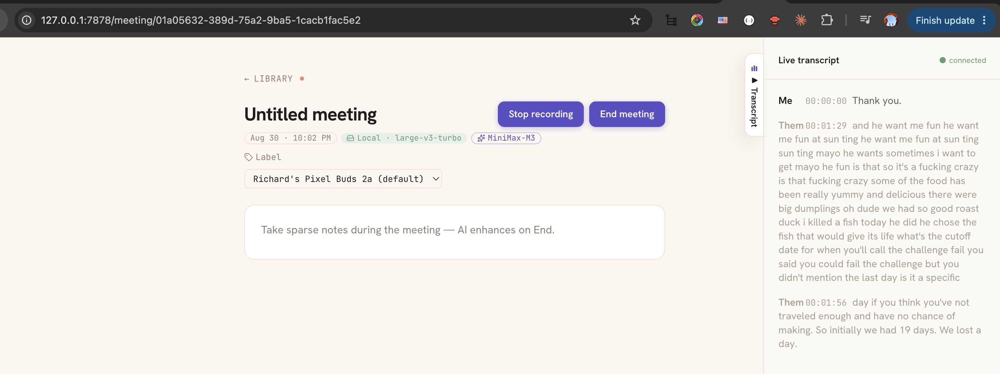

  Back from Library, dock empty except for lines that arrived after reconnect:
  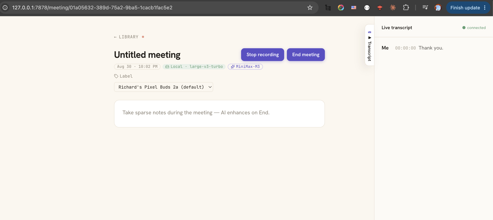

  Same meeting, still recording, after a hard refresh:
  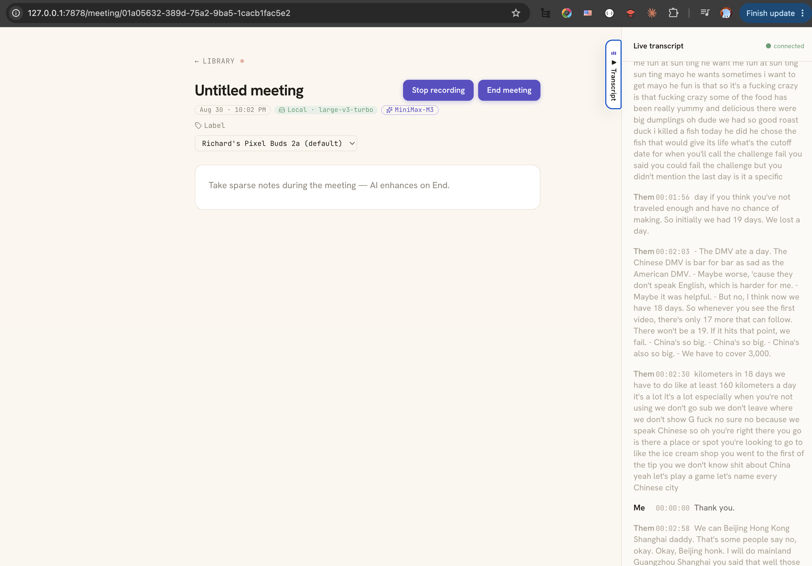
  </details>

## Audio

- [ ] **AUD-1** Live partials shrink mid-sentence on local STT, and never appear at all for system audio
  <details>
  <summary>Details</summary>

  Two symptoms, one cause each, both in the local whisper.cpp partial ticker (`crates/yogurt-stt/src/whisper_local.rs:261`). Deepgram is not involved; `ts_ms 00:00:00` on the in-flight line in the first screenshot is the local ticker's hardcoded `ts_ms: 0`, which is how you tell which engine produced a partial.

  **Partials shrink as you keep talking.** The ticker decodes a *rolling 5-second* buffer:

  ```rust
  // crates/yogurt-stt/src/whisper_local.rs:348
  let max = 16_000 * 5;
  if buf.len() > max {
      let excess = buf.len() - max;
      buf.drain(..excess);
  }
  ```

  Every 1 s tick re-decodes only the last 5 s of audio and emits the result as a whole-line replacement, so once an utterance passes five seconds the earliest words scroll out of the window and the displayed partial gets *shorter*. It reads as the transcript eating itself. The final is unaffected because it comes from a different path - the VAD segmenter, good for up to `MAX_SEGMENT_MS = 25_000` (`crates/yogurt-stt/src/vad.rs:63`) - which is why the full sentence reappears the moment you pause.

  Deepgram does not have this bug: `fold_deepgram_event` accumulates window-finals in `UtteranceState.buf` and emits `join_words(&st.buf, &transcript)`, so its partials only ever grow. The local ticker keeps no equivalent buffer.

  Fix direction: make the partial cumulative within the current VAD segment rather than a fixed rolling window - clear `partial_buf` on segment emit and let it grow to `MAX_SEGMENT_MS` - and cap decode cost by re-decoding at a coarser interval as the buffer grows, rather than by dropping audio. Confirm the decode stays inside the 1 s tick budget at 25 s of audio before committing to it; if it does not, the fallback is to keep the rolling window but emit an append-only delta rather than replacing the line.

  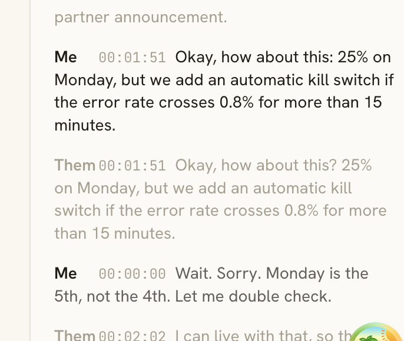
  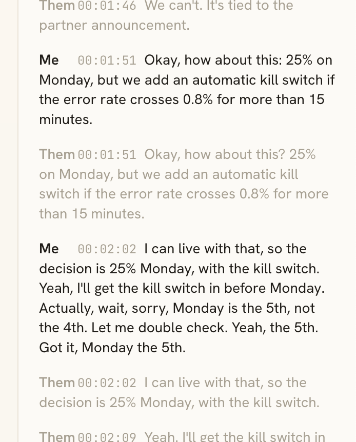

  **No partials at all on headphones.** The ticker is mic-only by design: *"Skipped for system audio in v1 to halve whisper.cpp pressure - PRD §13 only requires the still-listening indicator on the user's own voice."* `Channel::System` therefore has no partial path and only ever renders VAD-segment finals, which is the reported "shows in chunks after each sentence".

  This also explains why the report says the bug only happens on the Mac speaker. On speakers the mic re-captures the speaker output, so the meeting audio lands on `Channel::Mic` *as well* and picks up the ticker - visible in the first screenshot as `Me` and `Them` carrying identical text at `00:01:51`. On headphones there is no bleed, the far end exists only on `Channel::System`, and the streaming indicator disappears. The mystery in the report ("I don't know how it's getting the audio at all") is just system loopback: SCK capture is independent of the output device.

  Decide whether the v1 mic-only tradeoff still holds now that the asymmetry is user-visible. Enabling the ticker for `Channel::System` doubles whisper.cpp pressure, so it needs a perf spike on the smaller models first. The echo-bleed duplicate lines are a separate issue - worth its own entry if it bothers you beyond this bug.
  </details>

- [ ] **AUD-2** Add NVIDIA Parakeet v3 to the local STT model download
  <details>
  <summary>Details</summary>

  The model registry at `crates/yogurt-stt/src/models.rs` only ships whisper.cpp checkpoints today (tiny.en, small.en, medium.en, large-v3), pulled by `scripts/refresh-model-hashes.sh`.
  Add Parakeet v3 as a downloadable local model - new `ModelSpec` entry, download URL, SHA256 pin, and the engine adapter if Parakeet can't reuse the whisper.cpp runtime.
  Heads-up: Parakeet is an NVIDIA NeMo checkpoint, not a ggml/gguf file - decide the engine first (NeMo ONNX export, whisper.cpp's Parakeet backend, or a new `yogurt-stt` engine next to `WhisperLocal`) before scoping this.
  Scoping research done (2026-08-29), no code yet - engine decision needed first:
  Recommendation: sherpa-onnx with a new `ParakeetLocal` engine next to `WhisperLocal` (official Rust bindings, statically linkable, ships a tested parakeet-tdt-0.6b-v3 int8 archive with a stable URL).
  parakeet.cpp is the cleanest ggml/Metal fit but has no Rust bindings and is pre-1.0 - revisit in 6-12 months.
  Open decisions before scoping: accept Apache-2.0 (sherpa-onnx) alongside MIT; its build.rs downloads a prebuilt static lib at build time; CPU-only inference needs a perf spike on Apple Silicon (no Metal path); Parakeet weights are CC-BY-4.0, so attribution may need surfacing in Settings.
  </details>

- [ ] **AUD-3** Capture more than one audio input at a time (multiple mics, or a mic plus one specific app)
  <details>
  <summary>Details</summary>

  Capture is exactly two fixed channels today: one mic device and whole-system loopback.
  `Channel` (`crates/yogurt-audio/src/frame.rs:19`) has precisely `Mic` and `System`, `spawn_mic_capture` (`crates/yogurt-audio/src/mic.rs:175`) takes a single `Option<&str>` device name, and the mid-recording hot-swap (`Registry::switch_mic_device`, `crates/yogurt-server/src/meetings.rs:709`) changes *which* single device is live, never adds a second.

  The headphones-plus-Zoom case in the ask is already covered, though: the SCK content filter is display-rooted with no window exclusions (`crates/yogurt-audio/src/system.rs:165`), so Zoom, Chrome, and everything else already land on `Channel::System` while the headphone mic lands on `Channel::Mic`. What is genuinely missing is N mics (two people at one laptop, or a USB interface alongside the built-in) and per-app system audio instead of all-or-nothing.

  Two independent halves, scope them separately:

  1. **N mic devices.** `Channel` becomes indexed rather than a two-variant enum, which ripples into the `tokio::select!` fan-in, the broadcast-sender-per-channel model, and speaker attribution in the transcript. Cheaper alternative: keep two channels and mix N devices down into `Channel::Mic` before the ring, which costs nothing downstream but throws away per-device separation. Decide which before writing code.
  2. **Per-app system audio.** `SCContentFilter` can be built app-rooted instead of display-rooted, so "just Zoom" is a filter change rather than an architecture change. Check the app-filter API is available at the macOS 13 deployment target.

  Zero-code answer that exists today: a macOS aggregate device (Audio MIDI Setup) presents N inputs to cpal as one device. Worth documenting in the README before building anything.
  </details>

- [ ] **AUD-4** Ship a local STT model with the release instead of downloading from HuggingFace on first run
  <details>
  <summary>Details</summary>

  Every entry in `REGISTRY` (`crates/yogurt-stt/src/models.rs:74`) points at `huggingface.co/ggerganov/whisper.cpp`, so first-run local STT needs HF reachable. Same class of problem as the CLI-LLM item under ## LLM: a locked-down machine can install yogurt and still not transcribe.

  Licensing is not the blocker. The ggml checkpoints in `ggerganov/whisper.cpp` are MIT, as are the upstream OpenAI weights, so redistribution is fine with attribution added to `THIRD_PARTY_LICENSES.md`.

  Size is the blocker, and it decides between the three options:

  - **Embed in the binary: no.** tiny.en is 75 MB against an 11.7 MB binary, and rust-embed puts it in the Mach-O, so every user pays for it whether they use local STT or not. Cloud-STT users would carry a 7x binary for nothing.
  - **Commit to the repo: no.** GitHub warns at 50 MB and hard-blocks pushes over 100 MB, so only tiny.en fits at all, and only through Git LFS, whose bandwidth quota is billed and burned by every clone. It also bloats the repo permanently for contributors.
  - **Attach to the GitHub Release: yes.** 2 GB per asset, no LFS, no repo bloat, and `release.yml:119` already uploads a `files:` list. `ggml-tiny.en.bin` becomes one more asset plus a `REGISTRY` URL change.

  Scoping notes: pin the asset URL to its tag rather than `latest`, so an old binary keeps resolving the model it was built against. Keep HF as a fallback rather than replacing it, since the release asset is a mirror and not a new source of truth. The SHA256 pins are unchanged because it is byte-identical, which also means `scripts/refresh-model-hashes.sh` stays the verification path.
  </details>

## LLM

## CLI

## DONE

Closed-out work, kept here for context. Move a `- [x]` item here when the work lands.

<details>
<summary>Click to expand</summary>

### UI

- [x] **UI-1** BASE URL and MODEL fields overlap on long URLs in provider cards
  <details>
  <summary>Details</summary>

  On the Settings → LLM providers page, the Google Gemini card (active) has its BASE URL value `https://generativelanguage.googleapis.com/v1beta/openai` running straight through the MODEL value `gemini-2.5-flash`. The two are visually overlaid instead of sitting side-by-side in their two grid columns.

  Root cause is in `web/src/components/settings/ProviderRow.tsx:111` — `<div className="grid grid-cols-2 gap-x-6 gap-y-3">`. Grid items default to `min-width: auto`, so a child with non-wrapping content (here the URL wrapped in `break-all` text but the inner `<code>` is still wider than its column at full URL length) refuses to shrink below its intrinsic content size and overflows into the sibling column.

  Visual evidence:
  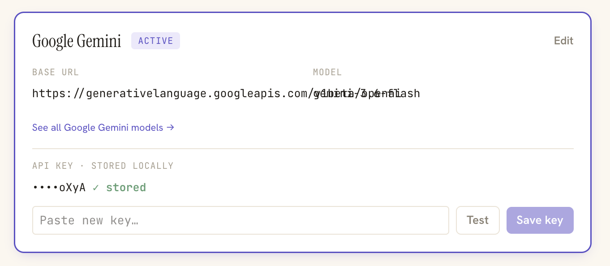
  </details>

  Landed in #9. `min-w-0` added to each `Field` child in the grid, in both `ProviderRow.tsx` (inactive card) and `ProviderCard.tsx` (active/edit card, whose BASE URL `<code>` was also missing `break-all`).

- [x] **UI-2** Add a "Test" button for the Deepgram key in Settings → Transcription
  <details>
  <summary>Details</summary>

  The LLM providers section has a Test button that does one live round-trip and reports a verdict inline (`web/src/components/settings/TestKeyButton.tsx`, backed by `POST /api/settings/providers/{id}/test`). The Transcription section's Cloud card has no equivalent, so a wrong or expired Deepgram key stays silent until a meeting produces no transcript, which is the worst possible time to find out.

  Two halves:

  1. Backend: a test endpoint for the STT key, alongside the existing `POST /api/settings/stt/key` in `crates/yogurt-server/src/api/settings.rs`. There is no STT equivalent of `test_provider` today. Deepgram's cheapest liveness check is probably a short authenticated request rather than opening a streaming socket; pick one that fails fast on a bad key without burning quota.
  2. Frontend: render the button on `CloudSTTCard` in `web/src/components/settings/STTPicker.tsx`. `TestKeyButton` is close to reusable as-is, but it is currently hardcoded to `settingsApi.testProvider(providerId, ...)`, so it needs the mutation passed in or a sibling component. Keep its two good behaviors: test the stored key when the input is empty, and hide the verdict once the draft no longer matches what was tested, so a green tick never sits next to edited text.

  Match the LLM card's verdict styling (matcha for ok, straw for failure) so the two sections read as one system.
  </details>

  Landed in PRs #2 and #3 (v0.2.0). The 2xx and 401 probe paths remain untested: the Deepgram URL is hardcoded, so it cannot be pointed at wiremock the way a provider's `base_url` can.

- [x] **UI-3** Chat input loses its pill shape on focus
  <details>
  <summary>Details</summary>

  The library search field stays pill-shaped when focused, with a lavender pill outline wrapping the input.
  The in-meeting "Ask this meeting..." input is also pill-shaped when collapsed, but once you click into it, the text field drops the pill background and renders as a standard rectangular input with a thick focus ring.
  It should match the search field - same pill shape on focus.

  Visual evidence:
  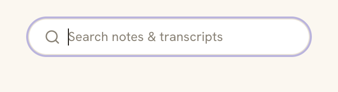
  
  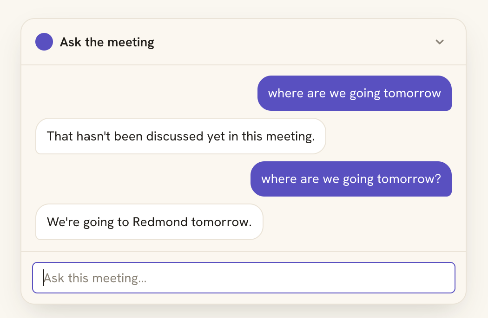
  </details>

- [x] **UI-4** Thick blue ring around the AI notes section when interacting
  <details>
  <summary>Details</summary>

  In the in-meeting notes panel, typing into "your notes" leaves a heavy blue/purple border wrapped around the AI-generated content on the right.
  Same on post-meeting notes: clicking into the meeting summary section triggers the same thick ring around the whole AI area.
  Nothing is actually focused in those cases - it's a styling bug (likely `:focus-within` or panel-active state styling the wrong target).
  Remove or restyle so it doesn't read as a focus indicator.

  Visual evidence:
  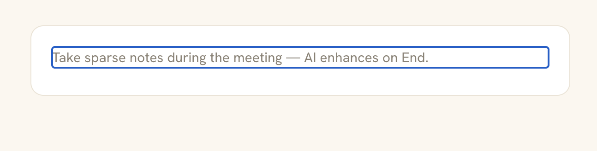
  </details>

### Meetings

- [x] **MTG-2** First "End meeting" click is a no-op while still recording; it takes two clicks to reach enhance
  <details>
  <summary>Details</summary>

  Root-caused, one-line fix. `MeetingPost` bounces straight back to the live route whenever the cached active-recording poll still names this meeting:

  ```tsx
  // web/src/routes/MeetingPost.tsx:578
  if (activeRecording.data?.id === meetingId) {
    return <Navigate to={`/meeting/${meetingId}`} replace />;
  }
  ```

  That guard exists for deep links, refresh, and the back button landing on the frozen post view for a meeting that is genuinely still recording. It cannot tell those apart from a legitimate `endMeeting` navigation, because the value it reads is stale by up to five seconds: `useActiveRecording` (`web/src/lib/api/meetings.ts:347`) polls `/api/meetings/active` on `refetchInterval: 5_000`, and `stopRecording` (`web/src/routes/Meeting.tsx:295`) invalidates only `meetingKey(meetingId)` - never `activeRecordingKey`.

  So the sequence is: `endMeeting` flushes notes, awaits `stopRecording`, navigates to `/post`, `MeetingPost` mounts against a cache that still says "recording", and `<Navigate replace>` sends the user right back. Nothing errors, nothing logs, the button just flashes.

  Both workarounds in the report follow from the same cause. A second click works because the 5 s poll has returned `null` by then; "Stop recording, then End meeting" works because the gap between the two clicks covers the staleness.

  Fix in `stopRecording`, not in the guard, so every caller is covered: `qc.setQueryData(activeRecordingKey, null)` (or invalidate it) alongside the existing `meetingKey` invalidation. Setting it directly beats invalidating, since invalidation still races the in-flight refetch. Regression test: stop, navigate to `/post` with the active-recording cache still populated, assert the route renders rather than redirecting.
  </details>

  **Landed.** `stopRecording` now writes `null` into `activeRecordingKey` itself rather than waiting for the poll (`web/src/routes/Meeting.tsx:322`). Regression test in `Meeting.test.tsx` seeds the cache the way the poll would, ends the meeting, and asserts the cache is cleared; it fails with `expected { id: 'meeting-3', … } to be null` if the line is removed.


- [x] **MTG-3** Black "your notes" vs grey AI blocks in the enhanced summary is confusing and misapplies when notes are empty
  <details>
  <summary>Details</summary>

  The post-meeting enhanced summary color-tints each block by source: `Source::User` blocks render black ("your notes"), `Source::AiGrey` blocks render grey with a transcript deep-link (`crates/yogurt-notes/src/render.rs` wraps them in `<span data-ai-grey data-ts="N">`).
  When the user's notes are empty, the expectation is that everything in the enhanced AI summary is grey AI output.
  Observed instead: the whole summary reads as black "your notes", so the grey/black distinction feels broken or inverted.

  Two things to do:
  1. Clarify and document how the black-vs-grey split is actually supposed to work (what makes a block `User` vs `AiGrey` - see `crates/yogurt-notes/src/diff.rs` for the user/AI merge rules), and confirm the intended mapping against the frontend styling.
  2. Fix the mismatch: when the user has no notes (`user_notes` empty), the merged doc should come out all `AiGrey` (all grey) - if it's rendering black instead, find where blocks are being tagged `Source::User` when there was no user input to attribute to them.

  Verify E2E: record a meeting with no notes typed, enhance, and confirm every block in the summary is grey; then type notes and confirm those specific blocks render black while AI additions stay grey.

  Resolved 2026-08-30. Two root causes:
  1. Frontend: the `aiGrey` promote-on-edit plugin (`web/src/editor/marks/aiGrey.ts`) treated TipTap's programmatic `setContent(html, false)` replace as one giant user insertion and stripped the grey mark from the entire document on every post-view load, Re-enhance, and tab switch. It now skips transactions carrying TipTap's `preventUpdate` meta.
  2. Backend: `crates/yogurt-notes/src/render.rs` never marked AI headings (and h1/h3 fell through to the paragraph branch), so with empty notes the inferred headings always read as ink "your notes". AI headings are now wrapped in `<span data-ai-grey>` (no deep-link).
  Contract, as documented in `render.rs`: a block is black only when `diff::merge` finds its text in the user's own notes; everything else the LLM produced is grey, headings included.
  </details>

- [x] **MTG-4** Add an "enhanced with" pill next to the existing STT pill on meeting headers
  <details>
  <summary>Details</summary>

  `MeetingMetaPills` (`web/src/components/MeetingMetaPills.tsx`) already shows a `[Local · small.en]` / `[Cloud · nova-2]` pill for the STT engine, stamped at recording start.
  Mirror that for the LLM: when a meeting has been enhanced (or is in the middle of being enhanced), surface an `[Enhanced with · gpt-5-mini]` (or `Local · llama-3` / etc.) pill in the same row so users know which model fused their notes with the transcript.

  Shape to match the existing pill: `parseSttEngine`-style splitter, `Local` (matcha) vs `Cloud` (blue) tones, `Sparkles`/`Cloud`/`HardDrive` lucide glyph, neutral when no LLM ran yet.

  Backend: stamp `llm_enhancement` on the meeting row when enhance kicks off (parallel to `stt_engine` at recording start) - something like `"local · qwen2.5-7b"` or `"cloud · claude-haiku-4-5"`. Persist the same shape used today for STT so the pill code can share parsing.
  Render the pill only after enhance has actually run (or is in flight) - a meeting that was recorded but never enhanced should show only the STT pill, not a guessed LLM pill.
  Library card (`MeetingCard`) already reuses `MeetingMetaPills` - it should pick this up for free once the row carries the new column.

  Verify E2E: record → enhance locally with a known model → confirm the pill appears in the post-meeting header, the library card, and during a re-enhance with a different model the pill updates to the new one.

  Done 2026-08-29.
  Reused the existing `meetings.llm_model` column (V008, bare model name stamped by enhance.rs) instead of a new `llm_enhancement` column, and skipped the local/cloud split: the LLM is always a BYO OpenAI-compatible endpoint, so the app has no local-vs-cloud signal to key a tone on.
  `LlmPill` (`Sparkles` glyph, blueberry tone, `Enhanced · <model>`) sits next to `EnginePill` in the live header, post-meeting header, and library card; `POST /enhance` now returns `llm_model` so the post-meeting pill follows a re-enhance without a refetch.
  Verified in the browser against a real MiniMax enhance; a failed enhance keeps the previous stamp.
  </details>

- [x] **MTG-5** LLM pill missing on a live meeting (STT pill shows, LLM pill doesn't)
  <details>
  <summary>Details</summary>

  Starting a new meeting showed the STT pill but no LLM pill.
  Not a bug in the pill: `stt_engine` is stamped on the row at recording start (`routes.rs::start_meeting`), while `llm_model` is only stamped by `enhance.rs` after a successful enhance, so a live meeting has nothing to render and `LlmPill` correctly refuses to guess.

  Fixed 2026-08-30 in the live header only (`web/src/routes/Meeting.tsx`): when the row has no `llm_model`, fall back to the active provider's model from the already-cached `useSettings()`, mirroring the existing `stt_engine ?? activeRecording.stt` fallback.
  `MeetingMetaPills` grew an `llmPending` flag that flips the pill's tooltip to "Will enhance with <model>" so a pre-enhance pill doesn't claim the meeting was already enhanced.
  Post-meeting header and library card are untouched - a stored meeting that was never enhanced still shows no pill.
  Verified E2E against the running backend: "+ New meeting" now renders `[Local · large-v3-turbo] [MiniMax-M3]` while recording.
  </details>

- [x] **MTG-6** Short / empty post-meeting meetings should say "too short" and return to the library
  <details>
  <summary>Details</summary>

  When a meeting ends but has nothing meaningful to transcribe or enhance (very short duration, mostly silence, audio captured but no usable content), the post-meeting view runs enhance on near-empty input today.
  Detect this case and surface a clear "Meeting too short" state instead of producing augmented notes from nothing.
  Auto-return to the library (home screen) so the user isn't left in a blank post-meeting view they have to navigate out of manually.
  </details>

- [x] **MTG-7** Delete-confirm check should overlay, not shift the post-meeting topbar
  <details>
  <summary>Details</summary>

  In the post-meeting view, clicking the trashcan button shows the confirm checkmark inline, which then pushes the Enhance button and the rest of the top bar around (format/visual layout changes mid-click).
  Make the confirm step overlay-anchored under the trashcan (floating popover) instead of taking up flow space, so the topbar stays put.

  Visual evidence:
  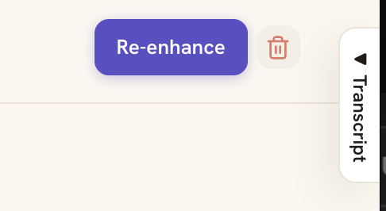
  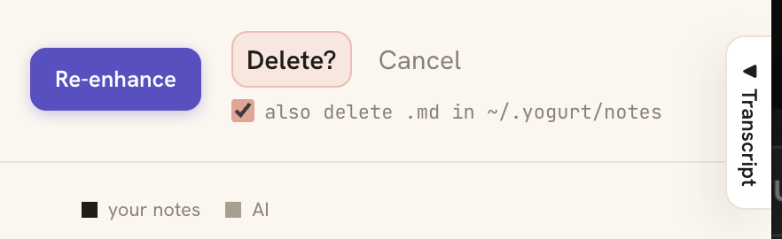
  </details>

- [x] **MTG-8** Live transcript duplicates when audio plays through the machine
  <details>
  <summary>Details</summary>

  During a live meeting, audio played on the Mac (system-audio playback, video with speech, etc.) shows up in the live transcript as duplicates rather than once.
  Root cause likely lives between `crates/yogurt-audio`'s mic and ScreenCaptureKit channels (acoustic echo into the mic plus digital capture, or an internal double-publish) - investigate and de-dupe.

  Visual evidence:
  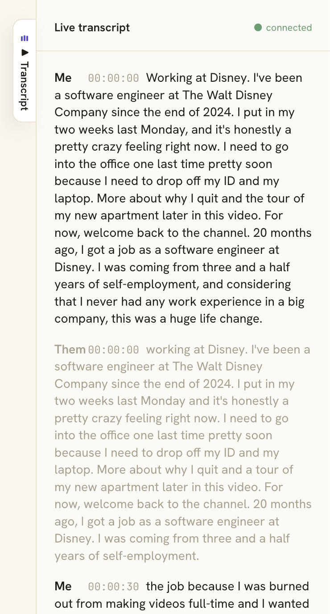
  </details>

### Audio

- [x] **AUD-5** Add the ability to delete a downloaded local STT model
  <details>
  <summary>Details</summary>

  The Settings → Local whisper.cpp panel lists every model with a `✓` + size when it's already downloaded under `~/.yogurt/models/`, but offers no way to remove one.
  Case in point: `large-v3` is sitting at 3.0 GB on disk and the only way to reclaim that space today is `rm -rf` by hand.
  Add a delete affordance per downloaded chip - probably a trash/X icon on hover, with a confirm step (matching the post-meeting trashcan UX) so a stray click doesn't nuke a 1.6 GB model.
  Backend: new `DELETE /api/local-stt/models/:name` that removes the directory + SHA-pinned file, returns the freed bytes, and rejects if the model is the currently active one (force the user to switch first).
  Frontend: invalidate the model list query so the chip flips back to "download" state and the size badge clears.

  Done 2026-08-29.
  Backend: the existing `DELETE /api/stt/models/{name}` now 409s when the model is the active local one, does the fs work on the blocking pool, and returns `200 {freed_bytes}` (idempotent, 0 if already gone).
  Frontend: trash icon next to every downloaded, non-active pill in `ModelPicker`, inline `Delete? / Cancel` confirm that auto-reverts after 3s, and a transient `Deleted <name> - freed <size>` line under the picker. Verified E2E in a sandboxed `$HOME` against a real `small.en` copy.
  </details>

### CLI

- [x] **CLI-1** Quiet the terminal during a live meeting; keep lifecycle lines and errors, drop the rest
  <details>
  <summary>Details</summary>

  `yogurt start` should read as a status line, not a firehose. The wanted set is roughly: server up and its URL, meeting started, meeting stopped, enhance started and finished, and anything that actually went wrong. Everything else belongs behind `RUST_LOG`.

  While in here, the default filter is `"yogurt=info,yogurt_server=info"` (`crates/yogurt-cli/src/main.rs:79`). `EnvFilter` matches targets by plain `starts_with` (tracing-subscriber 0.3.23, `filter/env/directive.rs:246`), so `yogurt=info` already covers `yogurt_server`, `yogurt_audio`, `yogurt_stt`, and every other `yogurt_*` crate. The second half is redundant and reads as if it were doing something. Drop it, or replace both with per-crate levels once the noisy targets are known.

  Careful not to overshoot: the point is a quiet terminal that still proves the thing is working, so lifecycle lines stay at `info!` and everything currently at `warn!`/`error!` keeps its level. Demote to `debug!` rather than delete, so `RUST_LOG=yogurt=debug` still gets you the detail when something needs diagnosing.
  
  **Landed.** Measured before fixing: whisper.cpp and ggml write 45 lines to stderr on model load and another 17 on *every* decode, through ggml's own log callback - which `params.set_print_*(false)` does not control, because those only govern whisper's transcript printing. With the partial ticker decoding once a second, a three-minute local-STT meeting emitted roughly 3,000 lines.

  Three changes:

  1. `whisper_rs::install_logging_hooks()` in `WhisperLocal::load`, plus the `tracing_backend` feature on the `whisper-rs` dep, so the C-side stream goes into `tracing` instead of straight to stderr.
  2. Default filter is now `yogurt=info,whisper_rs=warn` - ggml's INFO banners are dropped, its warnings and errors still surface, and `RUST_LOG=whisper_rs=debug` brings the detail back.
  3. Added the lifecycle lines that were missing entirely (`meeting_started` with provider and model, `meeting_stopped`, `enhance_complete` with model and elapsed, `enhance_skipped_too_short`) and demoted per-socket and teardown chatter in `meetings.rs`/`ws.rs` to `debug!`.

  Verified end to end against a real local-STT meeting on `large-v3-turbo`: start, record, stop, enhance now produces 13 lines total.

  Not addressed: the `audio adapter: * lagged` / `whisper_local audio rx lagged` warnings still fire un-throttled. In the verification run they came as one 270 ms burst at startup and nothing for the remaining 2.5 minutes, so they are signal about genuinely dropped audio rather than a firehose. Collapsing them to a periodic count is worth doing if they ever turn sustained.
  </details>

### LLM

- [x] **LLM-1** Route LLM calls through a local agent CLI (`claude -p`, `cursor-agent`) when no API endpoint is reachable
  <details>
  <summary>Details</summary>

  `LlmClient` (`crates/yogurt-llm/src/lib.rs:49`) is already the right seam: two methods, `complete` and `stream`, and the crate doc at line 12 anticipates a second implementation. A `CliClient` that spawns the agent CLI and implements the same trait needs no changes above it.

  It cannot be just another provider row with a different base URL. `OpenAiClient::new` (`crates/yogurt-llm/src/lib.rs:90`) assumes HTTP at `{base_url}/chat/completions`; agent CLIs speak stdin/stdout. Streaming maps onto `--output-format stream-json` on both CLIs, so `stream()` would parse that into `ChatChunk` the way `streaming.rs` parses SSE today.

  Open decisions before scoping:

  - **Terms of service.** Both CLIs authenticate against a coding subscription. Driving one as a general-purpose completion backend for meeting notes is a gray area, and it is the user's account that gets suspended if the read is wrong. Settle this before writing code, not after.
  - **Which problem this actually solves.** Not offline: both CLIs still call the cloud. It solves "corporate egress allows Claude Code but not `api.minimax.io`" and "user has no separate API key to pay for". Real, but narrower than it first sounds. True-offline is already covered by Ollama, which is an OpenAI-compatible base URL and works today with no code at all.
  - **Cost shape.** Process spawn per call, no connection reuse, cold start in the hundreds of ms. Fine for note enhancement at meeting end, likely not for anything per-utterance.
  - **Discovery and failure UX.** Settings would need to detect which CLIs are on `$PATH` and fail legibly when one is installed but not logged in. That failure is a non-zero exit with text on stderr, not an HTTP status, so the Test button plumbing needs a verdict path that is not `test_provider`'s.
  </details>

  Built, then decided against, in #17: implemented as an implicit fallback (`CliFallbackClient` wrapping the active `http` provider, retrying once on a connect-class failure to its `base_url`), but silently rerouting a meeting's real content to a different, unvetted backend on a network hiccup is a behavior change a user should choose, not one that happens to them mid-meeting. Ripped back out of the same PR before merge. The actual need - "let me use a local agent CLI as my LLM" - is covered by LLM-4 instead: explicit-only, the user picks the CLI as their active provider, nothing implicit ever substitutes it in. `yogurt_llm::CliClient` and its containment (`--restricted --strict-mcp-config --disable-slash-commands`, scratch cwd) survive as the mechanism LLM-4 uses.

- [x] **LLM-2** Test button for the API key should stay available on provider cards with saved models
  <details>
  <summary>Details</summary>

  On a provider card where a model is already saved in the MODEL field, the API KEY `Test` button should still be usable as a probe — typing a new draft key and clicking `Test` should run the same connection check it runs on a keyless card.
  If the button currently gets disabled, hidden, or stomped by some save/refresh state when a model is present, fix it so `Test` is reachable from every state a provider card can sit in (no key + no model, stored key + no model, no key + saved model, stored key + saved model).
  Likely suspects: `ApiKeyInput.canTest` (`web/src/components/settings/ApiKeyInput.tsx:83`) only looks at `draft || hasStoredKey` and ignores MODEL state, so the bug is probably upstream — a parent renders/hides `ApiKeyInput` based on MODEL state, or `onSaved` tears down the input before the user gets to test.
  Verify by hand: load a provider card with a saved model, paste a draft key, click `Test`, confirm a `✓` / `✗` line appears and the draft survives the click.

  Cause was upstream of `canTest`, as suspected: `ProviderRow` renders the whole `ApiKeyInput` only while `keying` is true, and `onSaved` flips it back to false — so an already-keyed provider (the one most worth probing) had no reachable `Test` at all.
  Fixed by extracting `TestKeyButton` from `ApiKeyInput` and rendering it next to `Replace key` in the collapsed state, where it tests the stored key.
  </details>

- [x] **LLM-3** Add Google Gemini and DeepSeek as built-in LLM provider presets
  <details>
  <summary>Details</summary>

  Both speak the OpenAI `/chat/completions` shape, so this needed no new client code in `yogurt-llm` - just `Preset` entries plus the matching `ENV_PRESETS` rows (`YOGURT_GEMINI_API_KEY`, `YOGURT_DEEPSEEK_API_KEY`) so keys seed into the Keychain on first run.
  Gemini goes through Google's OpenAI-compatible shim at `https://generativelanguage.googleapis.com/v1beta/openai`, not the native `generativeLanguage` REST shape.
  Neither was strictly blocked before this - "Add provider" already accepts a free-form base URL - so the win is one click instead of a URL nobody remembers.
  While here: `tests/bootstrap.rs` hand-listed the env vars it cleared, so adding a preset broke it only on machines that exported the new key.
  It now clears everything `bootstrap::env_key_vars()` reports.
  </details>

- [x] **LLM-4** Let a user pick a local agent CLI as their LLM provider outright
  <details>
  <summary>Details</summary>

  "I can't use any cloud model at all, I want to explicitly run `claude` (or `cursor-agent`) as my LLM" - explicit selection, not an automatic fallback (that shape was tried as LLM-1 and reverted; see its entry). Landed in #17. Two new provider presets, "Claude Code (local CLI)" and "Cursor Agent (local CLI)", appear in the same Settings → Model provider list as MiniMax/OpenAI/Ollama/etc. and can be set active like any other provider - no cloud provider needs to be configured at all.

  Needed a `providers.adapter` column (`'http' | 'cli'`, migration V009) since the existing table assumed every row was HTTP-shaped (`base_url` + `model` + a stored API key). A `cli` row repurposes `model` to hold the `yogurt_llm::CliProgram` id instead of a model name, leaves `base_url` empty, and never has a key - `llm_openai::resolve` branches on `adapter` and calls `yogurt_llm::CliClient::locate` directly. Settings API (`create_provider`, `test_provider`, `list_provider_models`) and the provider card/row components (`ProviderCard.tsx`, `ProviderRow.tsx`) branch the same way: no BASE URL / API KEY UI for a `cli` row, just a one-line note and a `Test` button reachable with no key.

  A separate `providers.cli_model` column (migration V010) holds the `--model` alias override, since `providers.model` is already spoken for by the `CliProgram` id and is never user-edited. The Settings UI shows a MODEL field for `cli` rows too - a bare `ComboBox` (no live `Refresh`, since there's no `/v1/models` catalog to probe) seeded from the preset's `models` list ("haiku" / "sonnet" / "opus" / "fable" for Claude Code; empty for Cursor Agent, whose valid `--model` values are unverified against a live binary). Empty `cli_model` means "use the CLI's own default".

  The MODEL picker is gated behind a passing `Test`, not shown unconditionally: a freshly-cloned row (`PresetChip` no longer seeds `cli_model` at all) shows only the note and `Test` until the CLI proves it actually connects, since there's nothing to override on a row that might not even resolve on `$PATH`. Once `Test` comes back `ok`, the picker appears and - if `cli_model` is still empty - gets PATCHed to the preset's `default_cli_model` so it opens on a sane value instead of blank. `!!provider.cli_model` is what keeps the picker visible on every later visit (no extra "was it tested" column needed); picking a different model PATCHes on commit, and re-running `Test` after that tests whatever's currently saved.

  `cursor-agent` hit a "Workspace Trust Required" wall in manual testing, since every call gets a fresh never-before-seen scratch `cwd`. Fixed with `--trust`, not `--yolo`/`--force` (cursor-agent's broad auto-approve-commands flag) - same reasoning as never passing `--dangerously-skip-permissions` to `claude`, since meeting-transcript text is untrusted input. `--sandbox enabled` is the closest documented equivalent to claude's `--restricted`. `claude` additionally gets `--effort low`, unconditional and not user-configurable: enhance/chat are extraction calls, not open-ended reasoning, so the lowest effort setting has no real quality cost.

  Manual browser verification against an isolated `HOME` (never the real `~/.yogurt/`) caught a real bug in `CliClient::run`: `claude --output-format json` writes a structured, actionable error to stdout even on a non-zero exit (confirmed live against a real "not logged in" account - `{"is_error":true,"result":"Not logged in · Please run /login"}`), but the code checked `status.success()` first and only looked at stderr, so the Settings `Test` button showed a useless "claude CLI exited with exit status: 1: " instead of the real reason. Fixed by extracting `interpret_output` (pure, parses stdout as JSON before checking exit status) with a unit-test regression covering exactly this shape.
  </details>

</details>